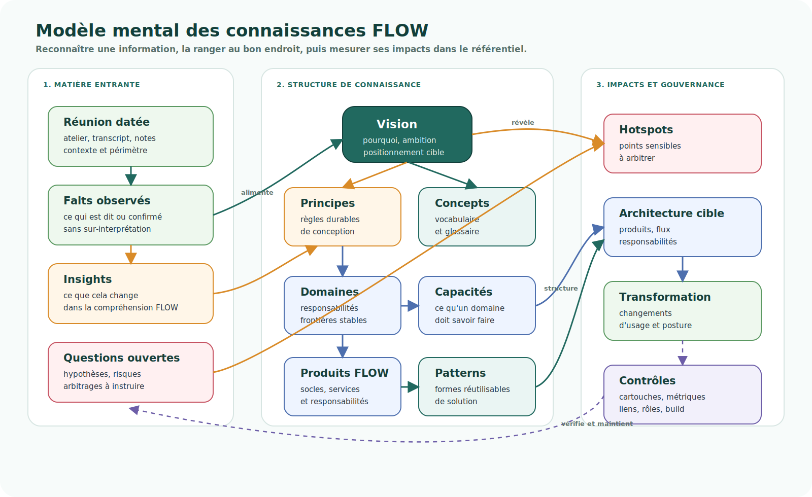

# Modèle mental des connaissances

<!-- FLOW-READING-CARD:START -->
<div class="flow-reading-card">
  <div class="flow-reading-card__title">Repère de lecture</div>
  <div class="flow-reading-card__grid">
    <div>
      <span>Public cible</span>
      <strong>Mainteneur, Contributeur, Codex</strong>
    </div>
    <div>
      <span>Temps de lecture</span>
      <strong>3 min</strong>
    </div>
    <div>
      <span>Usage</span>
      <strong>Maintenir le référentiel, l'environnement local et les contrôles</strong>
    </div>
  </div>
</div>
<!-- FLOW-READING-CARD:END -->

Cette page décrit le graphe logique qui structure le référentiel FLOW.

Elle sert à comprendre comment reconnaître une information, où la ranger, et quels impacts vérifier lorsqu'une page évolue.



## Idée directrice

Le référentiel FLOW n'est pas une collection de notes.

Il fonctionne comme une base de connaissance structurée :

- les réunions et ateliers produisent des faits, des insights et des questions ouvertes ;
- les insights nourrissent la vision, les principes, les hotspots et l'architecture cible ;
- les concepts et le glossaire stabilisent le vocabulaire ubiquitaire ;
- les domaines, capacités, produits et patterns permettent de passer de la compréhension métier à la solution ;
- l'administration du référentiel maintient les règles, les cartouches, les métriques et les contrôles.

## Concepts de rangement

| Concept | Question de reconnaissance | Emplacement naturel |
| --- | --- | --- |
| Source datée | D'où vient l'information ? Quand a-t-elle été observée ? | Page concernée, notes d'analyse, insights |
| Fait observé | Qu'est-ce qui a été dit, constaté ou confirmé ? | `contexte/`, `hotspots/`, `insights/` |
| Insight | Qu'est-ce que ce fait change dans notre compréhension de FLOW ? | `insights/`, parfois `vision/` ou `principes-directeurs/` |
| Question fréquente | Quel malentendu ou quelle objection revient souvent chez les lecteurs ? | `faq/index.md` pour les nouveaux, puis `faq/` pour les questions d'experts |
| Vision | Pourquoi FLOW existe et quelle ambition il porte ? | `vision/` |
| Principe directeur | Quelle règle durable doit guider les arbitrages futurs ? | `principes-directeurs/` |
| Concept clé | Quel vocabulaire structure la pensée FLOW ? | `vision/concepts-cles.md`, `glossaire.md` |
| Domaine | Quelle responsabilité stable doit être isolée des organisations et applications ? | `architecture-cible/`, principes, insights |
| Capacité | Que doit savoir faire un domaine ou la plateforme ? | `architecture-cible/produits/`, hotspots |
| Produit FLOW | Quel ensemble cohérent de responsabilités peut être construit ou gouverné ? | `architecture-cible/produits/` |
| Pattern | Quelle forme de solution réutilisable protège un principe ? | `architecture-cible/patterns/` |
| Hotspot | Quel point sensible doit être instruit avant de figer la cible ? | `hotspots/`, vision détaillée |
| Transformation | Quels changements de posture, d'usage ou de gouvernance cela provoque ? | `transformation/` |
| Règle de contribution | Comment maintenir le référentiel dans le temps ? | `administration/`, `AGENTS.md` |

## Chaîne logique

Une information nouvelle doit être lue comme une chaîne, pas comme une page isolée.

```text
Réunion datée
  -> faits observés
  -> insights
  -> vision / principes / hotspots
  -> domaines / capacités / produits / patterns
  -> architecture cible / transformation
  -> cartouches, métriques, contrôles
```

Cette chaîne évite deux erreurs :

- ranger une observation métier directement comme une solution ;
- transformer une hypothèse ou une tension en vérité d'architecture trop tôt.

## Règles d'impact

Quand une page change, vérifier les impacts selon la nature du changement.

| Si le changement concerne... | Vérifier aussi... |
| --- | --- |
| Une ambition ou un positionnement FLOW | Abstract, vision détaillée, concepts clés, principes directeurs |
| Une règle de conception | Principes directeurs, architecture cible, patterns, transformation |
| Un nouveau terme structurant | Concepts clés, glossaire, liens depuis les pages qui l'utilisent |
| Un domaine ou une responsabilité | Architecture cible, produits FLOW, hotspots, transformation |
| Une capacité ou un produit FLOW | Overview plateforme, fiches produits, patterns, hotspots |
| Une tension ou décision à instruire | Hotspots, vision détaillée, journal des insights |
| Un fait issu d'une réunion | Source datée, insights, analyse co-construite, questions ouvertes |
| Une règle de contribution | AGENTS.md, Instructions Codex, index d'administration, check-site |

## Ce que Codex utilise implicitement

Pour maintenir le site, Codex s'appuie sur ce modèle mental :

- identifier la nature de l'information avant de choisir une page ;
- distinguer fait, interprétation, insight, décision et question ouverte ;
- chercher les concepts déjà existants avant d'en créer de nouveaux ;
- vérifier les impacts transverses lorsqu'une notion devient structurante ;
- maintenir les cartouches, statistiques, liens, rôles et contrôles après modification.

Ce modèle doit rester compréhensible par un humain. Si la structure du référentiel devient difficile à expliquer avec ce graphe, il faut probablement simplifier la structure ou expliciter un nouveau concept.
