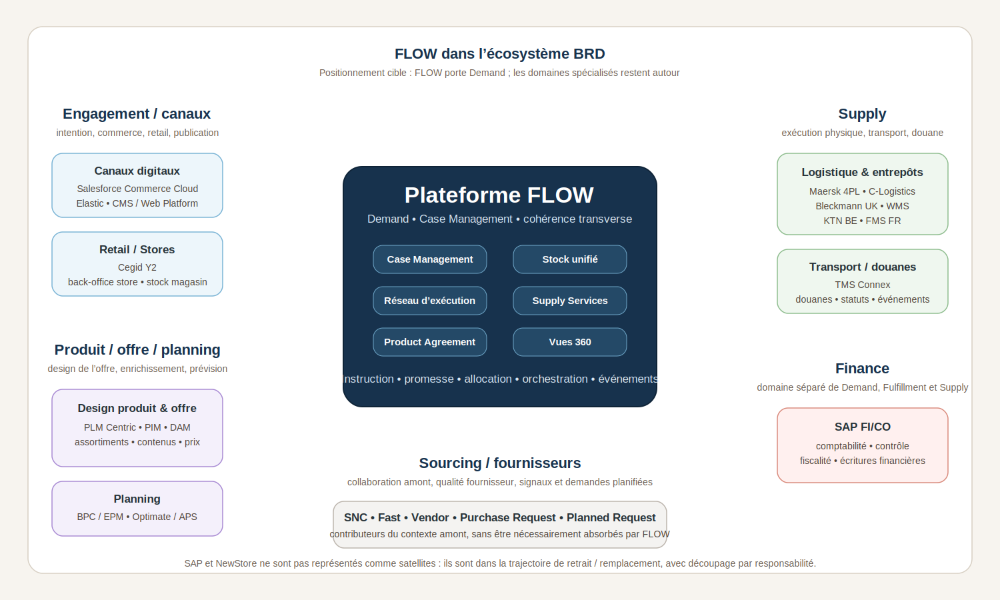

# FLOW dans l’écosystème BRD

<!-- FLOW-READING-CARD:START -->
<div class="flow-reading-card">
  <div class="flow-reading-card__title">Repère de lecture</div>
  <div class="flow-reading-card__grid">
    <div>
      <span>Public cible</span>
      <strong>Architecture, product owners, delivery</strong>
    </div>
    <div>
      <span>Temps de lecture</span>
      <strong>5 min</strong>
    </div>
    <div>
      <span>Usage</span>
      <strong>Relier les concepts FLOW aux produits, patterns et responsabilités cible</strong>
    </div>
  </div>
</div>
<!-- FLOW-READING-CARD:END -->

## Intention

Cette page propose un premier positionnement de FLOW dans l'écosystème applicatif BRD.

Elle complète le panorama applicatif BRD en distinguant :

- les applications et domaines qui restent autour de FLOW ;
- les responsabilités candidates à être reprises par FLOW ;
- les systèmes SAP et NewStore, qui sont dans la trajectoire de retrait ou de remplacement ;
- la Finance, qui doit rester représentée comme un domaine séparé.

Le but n'est pas de représenter tous les flux existants.

Le but est de rendre lisible le futur rôle de FLOW dans l'univers BRD.

## Schéma de positionnement



## Lecture du schéma

FLOW ne remplace pas tout le SI BRD.

FLOW se positionne comme la plateforme Demand qui reprend les responsabilités transverses aujourd'hui distribuées entre SAP, NewStore et plusieurs systèmes périphériques.

Autrement dit, FLOW reconstruit la colonne vertébrale opérationnelle du SI BRD : il donne une cohérence commune aux demandes, statuts, décisions métier, événements, stock et projections, sans déplacer tout BRD dans FLOW.

Le schéma représente les applications satellites qui peuvent rester autour de FLOW.

Il ne représente pas SAP et NewStore comme des satellites durables, car ces deux socles sont dans la trajectoire de retrait ou de remplacement.

| Zone | Rôle dans l'écosystème BRD |
| --- | --- |
| Engagement / canaux | Captent les intentions, exposent les parcours digitaux, retail ou B2B, et consomment les capacités FLOW. |
| Produit / offre / planning | Conçoivent les produits, assortiments, prix, contenus, assets et données nécessaires à l'offre. |
| Sourcing / fournisseurs | Contribuent à la collaboration fournisseur, à la qualité fournisseur et aux demandes amont. |
| Plateforme FLOW | Porte les Cases, le stock unifié, le réseau d'exécution, les projections opérationnelles et les Vues 360. |
| Supply | Exécute physiquement : entrepôts, préparation, transport, douane, opérations logistiques et événements d'exécution. |
| Finance | Porte les responsabilités comptables, fiscales, de contrôle et d'écritures financières. |

## Applications à retirer / remplacer

SAP et NewStore ne sont pas de simples applications satellites conservées autour de FLOW.

Ils sont le point de départ du périmètre de remplacement BRD.

```text
SAP
    → socle transactionnel historique
    → achats, ventes, logistique, stock entrepôt, billing, finance selon périmètres
    → responsabilités à découper avant de décider ce qui va dans FLOW

NewStore
    → OMS BRD
    → cycle de vie commande, omnicanal, promesse, allocation / réservation
    → intégration actuelle du stock entrepôt SAP et du stock magasin Cegid
    → responsabilités fortement candidates FLOW
```

La question n'est donc pas seulement :

> Comment remplacer SAP et NewStore ?

La question est :

> Quelles responsabilités de SAP et NewStore doivent être reprises par FLOW, lesquelles doivent rester hors FLOW, et lesquelles doivent être redistribuées vers des domaines spécialisés ?

## Applications satellites conservées autour de FLOW

Les applications de canal, de produit, de sourcing, de Supply ou de Finance ne disparaissent pas mécaniquement.

Elles peuvent rester :

- consommatrices de FLOW ;
- contributrices de projections ;
- sources d'événements ;
- systèmes d'exécution ;
- domaines spécialisés conservant leur autonomie.

Cette conservation suppose toutefois que ces applications soient réintégrables : APIs, événements, statuts, documents, identifiants de corrélation et mécanismes de réconciliation doivent être clarifiés pour éviter de conserver des silos branchés superficiellement.

Exemples :

```text
Salesforce Commerce Cloud / Elastic / CMS / Web Platform / Cegid Y2
    → engagement, commerce digital, retail, recherche, publication, opérations magasin

PLM Centric / PIM / DAM / BPC / Optimate
    → produit, offre, planning, prévision, assortiment, contenu et assets

SNC / Fast
    → collaboration fournisseur, qualité fournisseur, demandes ou signaux amont

Maersk / C-Logistics / Bleckmann / WMS / TMS Connex / KTN / FMS
    → Supply, entrepôts, préparation, transport, douane, événements d'exécution

SAP FI/CO / Finance
    → comptabilité, contrôle, fiscalité, écritures financières
```

## Point sur Cegid Y2

Cegid Y2 doit être traité avec attention.

Il ne porte pas seulement une expérience retail ou une interface magasin.

Il porte aussi le back-office centralisé des stores et le stock magasin.

C'est donc un contributeur structurant de la visibilité de stock.

Dans la cible, Cegid peut rester autour de FLOW comme système retail / store operations, mais FLOW devra clarifier comment il consomme ou consolide les faits de stock magasin.

Cette distinction est essentielle :

```text
SAP
    → stock entrepôt

Cegid Y2
    → stock magasin

NewStore aujourd'hui
    → intégration des deux pour l'OMS, la promesse et certains arbitrages omnicanaux

FLOW demain
    → capacité cible de stock unifié et de décision métier sur la demande
```

## Point sur le PIM

Le PIM BRD ne doit pas être considéré par défaut comme un composant à intégrer dans FLOW.

S'il soutient le processus de design de l'offre, d'enrichissement produit, d'assortiment, de commercial agreement, de prix ou de publication vers les canaux, il relève plutôt de la zone Produit / Offre / Engagement.

FLOW a en revanche besoin d'une projection produit d'exécution.

Cette projection doit fournir les informations nécessaires pour instruire un Case, promettre, allouer, réserver, exécuter et suivre une demande.

Elle ne doit pas transformer FLOW en PIM bis.

## Finance séparée de Demand, Fulfillment et Supply

La Finance ne doit pas être rangée dans Supply, ni absorbée dans Fulfillment.

SAP FI/CO et les responsabilités financières restent un domaine séparé.

FLOW peut produire ou consommer des documents, faits, événements économiques ou références nécessaires à la comptabilité.

Mais FLOW ne remplace pas la comptabilité, la fiscalité ou le contrôle de gestion.

Cette séparation est particulièrement importante dans le cas BRD, car SAP porte aujourd'hui à la fois des responsabilités transactionnelles, logistiques, de stock, de billing et de finance.

La trajectoire cible doit donc découper SAP par responsabilité, et non raisonner comme si toutes les responsabilités SAP basculaient mécaniquement dans FLOW.

## Positionnement cible

La cible ne consiste pas à déplacer tout BRD dans FLOW.

La cible consiste à clarifier ce qui relève de FLOW :

- le Case ;
- le cycle de vie transverse de la demande ;
- les décisions métier liées à la demande ;
- la promesse ;
- les réservations et allocations ;
- le stock unifié ;
- le réseau d'exécution ;
- les besoins d'exécution transmis aux acteurs Supply ;
- les projections opérationnelles nécessaires ;
- les événements qui enrichissent les Vues 360.

Et ce qui reste autour :

- les expériences client et canaux de vente ;
- la conception produit et l'enrichissement catalogue ;
- le planning et les prévisions ;
- la collaboration fournisseur spécialisée ;
- l'exécution logistique physique ;
- la douane et le transport ;
- la comptabilité et la finance.

## À retenir

FLOW devient le point de cohérence Demand dans l'univers BRD.

Il ne remplace pas tout le paysage applicatif.

La question n'est donc pas seulement de savoir quelles applications restent, mais lesquelles peuvent se brancher proprement sur la colonne vertébrale FLOW.

Il retire progressivement SAP et NewStore de la cible, mais en découpant leurs responsabilités : certaines relèvent de FLOW, certaines relèvent de Finance, certaines relèvent de Supply, et certaines restent portées par des systèmes spécialisés.

Le point le plus structurant est le stock : SAP porte le stock entrepôt, Cegid porte le stock magasin, et NewStore intègre aujourd'hui les deux.

La cible FLOW doit donc reconstruire explicitement cette cohérence autour du stock unifié, du Case, de la promesse, de l'allocation et du réseau d'exécution.
