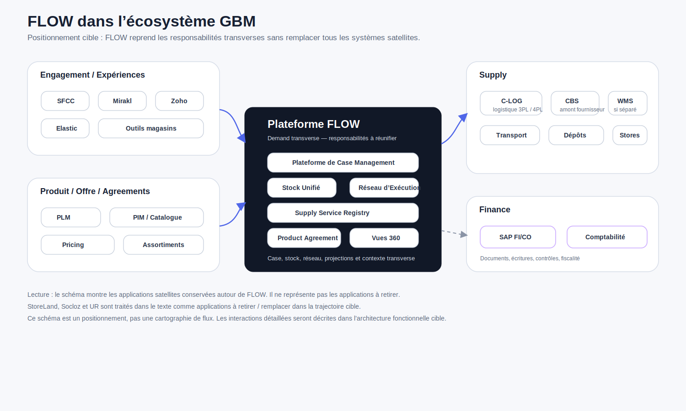

# FLOW dans l’écosystème GBM

<!-- FLOW-READING-CARD:START -->
<div class="flow-reading-card">
  <div class="flow-reading-card__title">Repère de lecture</div>
  <div class="flow-reading-card__grid">
    <div>
      <span>Public cible</span>
      <strong>Architecte, Développeur, Delivery</strong>
    </div>
    <div>
      <span>Temps de lecture</span>
      <strong>3 min</strong>
    </div>
    <div>
      <span>Usage</span>
      <strong>Relier les concepts FLOW aux produits, patterns et responsabilités cible</strong>
    </div>
  </div>
</div>
<!-- FLOW-READING-CARD:END -->

## Intention

Cette page propose un premier positionnement de FLOW dans l'écosystème applicatif GBM.

Elle ne cherche pas à représenter tous les flux existants.

Elle sert à montrer comment FLOW se place par rapport :

- aux expériences et applications d'engagement ;
- aux systèmes produit, catalogue et agreements ;
- aux systèmes Supply ;
- à Finance ;
- aux applications historiques StoreLand, Socloz et UR, qui sont à retirer / remplacer dans la trajectoire cible.

## Schéma de positionnement



## Lecture du schéma

FLOW ne remplace pas tout le SI GBM.

FLOW se positionne comme la plateforme Demand qui reprend les responsabilités transverses aujourd'hui dispersées entre plusieurs composants.

Autrement dit, FLOW reconstruit la colonne vertébrale opérationnelle du SI GBM : il donne une cohérence commune aux demandes, statuts, décisions métier, événements, stock et projections, sans déplacer tout GBM dans FLOW.

Le schéma représente les applications satellites qui restent autour de FLOW.

Il ne représente pas les applications à retirer.

| Zone | Rôle dans l'écosystème |
| --- | --- |
| Engagement / Expériences | Captent les intentions, exposent les parcours client et consomment les capacités FLOW. |
| Produit / Offre / Agreements | Construisent ou gouvernent les produits, catalogues, assortiments, agreements et conditions. |
| Plateforme FLOW | Porte les Cases, le stock unifié, le réseau d'exécution et les projections nécessaires à l'instruction des demandes. |
| Supply | Exécute, confirme, transporte, stocke, prépare ou publie des événements opérationnels. |
| Finance | Porte les responsabilités comptables, fiscales, de contrôle et d'écritures financières. |

## Applications à retirer / remplacer

StoreLand, Socloz et UR ne sont pas de simples satellites conservés autour de FLOW.

Ils sont dans la trajectoire de retrait ou de remplacement.

```text
StoreLand
    → socle historique retail multi-instances
    → commandes, stocks, opérations par marque
    → responsabilités à reprendre, remplacer ou redistribuer

Socloz
    → orchestration omnicanale / e-commerce
    → stock, promesse ou réservation à clarifier
    → responsabilités candidates FLOW

UR / United Retail
    → cycle de vie commande B2C transverse
    → retours, remboursements, litiges, réintégration stock
    → signal fort du besoin de Case Management transverse
```

Ces systèmes doivent être analysés par responsabilité.

La question n'est pas seulement :

> Quelle application remplace-t-on ?

La question est :

> Quelles responsabilités FLOW doit-il reprendre, généraliser ou rendre explicites ?

## Applications satellites conservées autour de FLOW

Les applications d'engagement, de produit, de Supply, de Finance ou d'exécution ne disparaissent pas mécaniquement.

Elles peuvent rester :

- consommatrices de FLOW ;
- contributrices de projections ;
- systèmes d'exécution ;
- sources d'événements ;
- domaines spécialisés conservant leur autonomie.

Cette conservation suppose toutefois que ces applications soient réintégrables : APIs, événements, statuts, documents, identifiants de corrélation et mécanismes de réconciliation doivent être clarifiés pour éviter de conserver des silos branchés superficiellement.

Exemples :

```text
SFCC / Mirakl / Zoho / Elastic
    → expériences, commerce, B2B, recherche, engagement

PLM / PIM / Pricing / outils d'assortiment
    → produits, catalogues, assortiments, agreements

C-LOG / CBS / Transport / Dépôts / WMS / magasins
    → Supply, exécution, collaboration fournisseur, statuts, événements

SAP FI/CO / Finance
    → comptabilité, contrôle, fiscalité, écritures financières
```

## Point sur C-LOG

C-LOG doit être représenté comme un acteur Supply à part entière, pas comme un simple EAI.

Dans la lecture cible, C-LOG est positionné comme une filiale ou un opérateur logistique 3PL / 4PL susceptible d'englober plusieurs responsabilités :

- stock entrepôt ;
- WMS ;
- préparation ;
- transport ;
- suivi d'exécution ;
- événements logistiques.

Il faudra donc éviter de réduire C-LOG à une brique d'intégration.

## Finance séparée de Supply

Finance ne doit pas être rangée dans Supply.

SAP FI/CO et les responsabilités financières restent un domaine séparé.

FLOW peut interagir avec Finance au travers de documents, événements économiques, statuts ou références, mais FLOW ne remplace pas la comptabilité, la fiscalité ou le contrôle de gestion.

## Positionnement cible

La cible ne consiste pas à déplacer tout GBM dans FLOW.

La cible consiste à clarifier ce qui relève de FLOW :

- le Case ;
- les décisions métier ;
- les promesses ;
- les facts stock ;
- les réservations ;
- les allocations / tagging ;
- les besoins d'exécution ;
- les projections opérationnelles nécessaires ;
- les événements qui enrichissent les Vues 360.

Et ce qui reste autour :

- les expériences client ;
- la conception produit ;
- l'enrichissement catalogue ;
- la relation client spécialisée ;
- l'exécution logistique physique ;
- les documents fournisseur spécialisés ;
- la comptabilité et la finance.

## À retenir

FLOW devient le point de cohérence Demand dans l'univers GBM.

Il ne remplace pas tout le paysage applicatif.

La question n'est donc pas seulement de savoir quelles applications restent, mais lesquelles peuvent se brancher proprement sur la colonne vertébrale FLOW.

Il retire progressivement StoreLand, Socloz et UR de la cible, en reprenant ou redistribuant leurs responsabilités transverses.

Il laisse les applications satellites jouer leur rôle de consommateurs, contributeurs ou systèmes d'exécution lorsque leurs responsabilités restent spécialisées.
