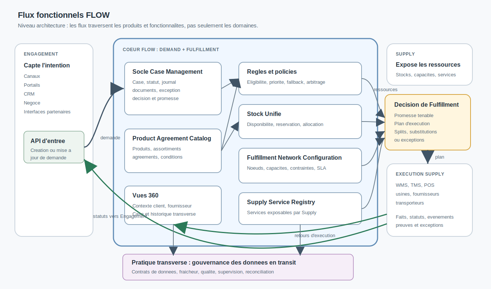

# Flux fonctionnels FLOW

<!-- FLOW-READING-CARD:START -->

  
Repère de lecture

  

    

      Public cible
      <strong>Architecte, Développeur, Delivery</strong>
    

    

      Temps de lecture
      <strong>3 min</strong>
    

    

      Usage
      <strong>Relier les concepts FLOW aux produits, patterns et responsabilités cible</strong>
    

  

<!-- FLOW-READING-CARD:END -->

Cette page porte le niveau architecture du "comment ça marche".

La page Vision [Modèle de fonctionnement de FLOW](../vision/modele-fonctionnement-flow.md) explique les notions et la chronologie de bout en bout.

Ici, la même logique est relue à travers les produits FLOW, les fonctionnalités attendues et les flux d'information.

## Lecture du flux

Le flux n'est pas une chaîne linéaire.

Il combine une demande initiale, des décisions de Fulfillment, des ressources Supply et des retours d'exécution.

1. Engagement crée ou met à jour une demande via une API d'entrée.
2. Le Socle Case Management crée ou actualise le Case, son statut, son journal et ses exceptions.
3. Product Agreement Catalog apporte le contexte produit, agreement, assortiment et conditions applicables.
4. Les règles et policies qualifient l'éligibilité, les priorités, les substitutions, les fallbacks et les exceptions.
5. Stock Unifié expose la disponibilité, les réservations et les allocations utiles à la décision.
6. Fulfillment Network Configuration décrit les nœuds, capacités, contraintes et SLA mobilisables.
7. Supply Service Registry décrit les services Supply appelables et leurs conditions d'usage.
8. La décision de Fulfillment produit une promesse tenable et un plan d'exécution.
9. Supply exécute ou confirme, puis remonte faits, statuts, événements, preuves et exceptions.
10. FLOW met à jour le Case, les vues, les projections et les informations retournées vers Engagement.

## Produits traversés

| Produit ou domaine | Contribution dans le flux |
| --- | --- |
| Engagement | Capte l'intention, porte le parcours et consomme les statuts ou promesses. |
| Socle Case Management | Porte le Case, son cycle de vie, son journal, ses documents, ses décisions et ses exceptions. |
| Product Agreement Catalog | Expose le contexte produit, achat, vente, agreement, assortiment et conditions. |
| Règles et policies | Externalisent les critères de décision et évitent d'enfermer les cardinalités métier dans un modèle rigide. |
| Stock Unifié | Rend la disponibilité exploitable pour promettre, réserver, allouer et réarbitrer. |
| Fulfillment Network Configuration | Décrit le réseau d'exécution mobilisable : sites, usines, partenaires, capacités, contraintes et SLA. |
| Supply Service Registry | Donne à FLOW une lecture gouvernée des services Supply appelables. |
| Vues 360 | Restituent le contexte transversal autour d'un Case, d'un client, d'un fournisseur ou d'une usine. |
| Diffusion et gouvernance des données en transit | Transforme les flux projet en contrats de données supervisables et réconciliables. |
| Supply | Exécute, confirme, signale les contraintes et publie les événements d'exécution. |

## Fonctionnalités à concevoir

Ce schéma permet de faire émerger les fonctionnalités sans partir directement d'un outil.

Les capacités minimales à instruire sont :

- API de création et de mise à jour de demande ;
- cycle de vie du Case ;
- journal des faits, événements et décisions ;
- rattachement des documents et preuves ;
- moteur ou service de règles et policies ;
- interrogation de disponibilité et réservation ;
- allocation, sourcing, substitution et fallback ;
- calcul de promesse et de plan d'exécution ;
- publication de statuts vers Engagement ;
- ingestion des événements Supply ;
- gestion des exceptions et réarbitrages ;
- projections et Vues 360 ;
- contrats de données, supervision et réconciliation.

## Retours d'information

La remontée d'information est une responsabilité de premier niveau.

FLOW ne peut pas seulement pousser un plan d'exécution vers Supply.

Il doit aussi recevoir les faits qui permettent de tenir, expliquer ou réviser la promesse :

- confirmation de disponibilité ;
- retard ou indisponibilité ;
- changement de capacité ;
- statut de préparation, transport, réception ou livraison ;
- document ou preuve réglementaire ;
- exception opérationnelle ;
- annulation, split ou replanification.

Ces retours alimentent le Case, les projections, les Vues 360 et les informations exposées aux parcours d'Engagement.

## Lien avec la vision

La vision dit : FLOW porte Demand + Fulfillment et raccorde Engagement à Supply.

L'architecture fonctionnelle traduit ce message en produits et fonctionnalités.

Elle évite deux dérives :

- réduire FLOW à une simple intégration entre applications ;
- transformer FLOW en monolithe qui absorberait tous les outils Engagement et Supply.

Le bon niveau de conception consiste à gouverner les demandes, décisions, promesses, statuts et événements transverses, tout en laissant les domaines adhérents conserver leurs responsabilités propres.
