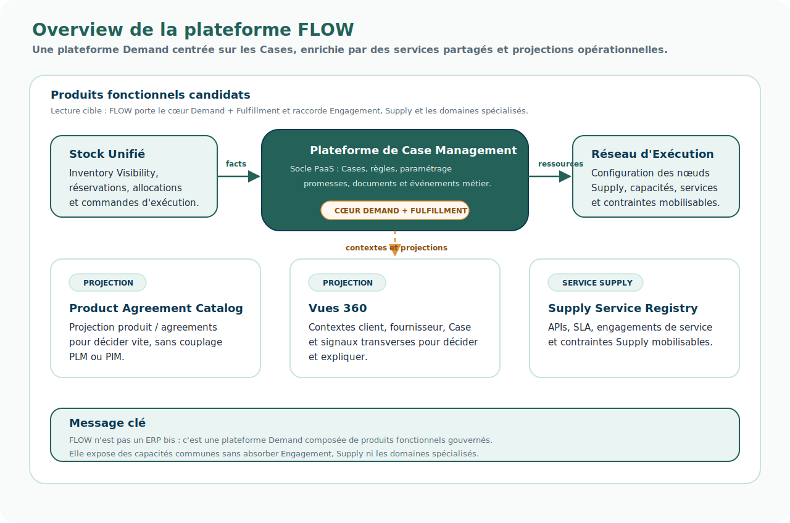

# Overview de la plateforme FLOW

## Intention

Cette page propose un premier overview de la plateforme FLOW.

Elle ne cherche pas encore à détailler les flux, les APIs ou les choix techniques.

Elle cherche d'abord à montrer comment la vision de convergence peut se traduire en produits fonctionnels.

Le point de départ n'est pas : “quelle plateforme voulons-nous construire ?”.

Le point de départ est :

> Quelles responsabilités doivent devenir communes, gouvernées et transverses pour permettre la convergence, sans centraliser tout le SI ?

FLOW est ici décrit comme une plateforme Demand fédérée.

Elle est centrée sur les Cases, enrichie par des services partagés et des projections opérationnelles.

## Schéma d'overview



## Produits FLOW candidats

| Produit | Rôle |
| --- | --- |
| Plateforme de Case Management | Piloter les demandes dans la durée. Les Cases portent le contexte, les décisions, les promesses, les documents et les événements. |
| Stock Unifié | Rendre la disponibilité fiable et exploitable. Porter les réservations, l'allocation / tagging, les facts et événements stock. |
| Fulfillment Network / Réseau d'Exécution | Décrire les nœuds logistiques, partenaires, capacités, contraintes, services et conditions d'usage mobilisables pour servir une demande. |
| Supply Service Registry | Référencer les services Supply exposés : APIs, SLA, conditions d'accès, éligibilités et contraintes. |
| Product Agreement Catalog | Exposer les produits, assortiments et agreements utiles à la vente, à l'achat et à l'exécution. |
| Vues 360 | Agréger le contexte transverse autour du client, du fournisseur ou du Case. |

## Lecture fonctionnelle

FLOW ne doit pas être lu comme un ERP, un OMS unique, un PIM, un CRM, un WMS ou un outil Finance.

FLOW doit être lu comme une plateforme de cohérence Demand.

Sa responsabilité est de rendre possible l'instruction, la décision, la promesse et l'orchestration de demandes transverses.

```text
Case
    → porte la demande dans la durée

Stock Unifié
    → fournit les facts stock et les réservations nécessaires

Fulfillment Network / Réseau d'Exécution
    → décrit les nœuds, capacités, contraintes et conditions d'usage mobilisables

Supply Service Registry
    → décrit les services Supply appelables

Product Agreement Catalog
    → donne le contexte produit / agreement nécessaire

Vues 360
    → donnent du contexte transverse et sont enrichies par les événements des Cases
```

## Point important : les Cases sont les objets actifs

La plateforme de Case Management fournit le runtime et les mécanismes nécessaires.

Mais l'objet actif n'est pas la plateforme elle-même.

Ce sont les Cases qui portent :

- le contexte ;
- les décisions ;
- les promesses ;
- les événements ;
- les documents ;
- les exceptions ;
- les interactions avec les autres produits FLOW.

Cette distinction est importante.

Elle évite de transformer la plateforme de Case Management en orchestrateur opaque.

Le Case reste l'unité métier d'orchestration.

## Nomenclature d'information appliquée

| Produit FLOW | Informations plutôt Source dans FLOW | Informations plutôt Projection dans FLOW |
| --- | --- | --- |
| Plateforme de Case Management | Case, décisions, événements FLOW, documents attachés | événements externes, documents externes, contexte projeté |
| Stock Unifié | stock disponible, réservations, allocations si calculées par FLOW | stock physique source, mouvements externes, statuts WMS / magasin |
| Fulfillment Network / Réseau d'Exécution | réseau, capacités, contraintes et conditions d'usage si gouvernés par FLOW | capacités ou contraintes issues de systèmes Supply |
| Supply Service Registry | éventuellement services normalisés FLOW | services, APIs, SLA exposés par Supply |
| Product Agreement Catalog | rarement source au départ | product core, agreements vente / achat, assortiments, conditions |
| Vues 360 | Case 360 probablement source ou dérivée FLOW | Customer 360, Supplier 360, historiques et signaux externes |

## Rupture de conception

Dans un ERP, les référentiels décrivent souvent l'entreprise telle qu'elle est.

Dans FLOW, les objets de configuration décrivent surtout ce qui permet de décider, promettre et exécuter.

Cette différence est structurante : FLOW ne cherche pas à reconstruire une master data globale.

FLOW cherche à définir les objets nécessaires pour traiter les demandes de manière fiable, explicable et optimisable.

## Ce que ce schéma ne dit pas encore

Cet overview ne détaille pas encore :

- les interfaces ;
- les flux unitaires ou de masse ;
- les événements publiés ou consommés ;
- les patterns d'intégration ;
- les choix de produits du marché ;
- la trajectoire de migration depuis StoreLand, Socloz, UR, SAP ou NewStore.

Ces éléments devront être traités dans des pages d'architecture fonctionnelle et de trajectoire.

## À retenir

FLOW est une réponse fédérée à un problème de convergence.

La plateforme Demand concentre les responsabilités qui doivent devenir communes — Case, décision, stock, réseau d'exécution, projections — sans chercher à absorber tout le SI.
