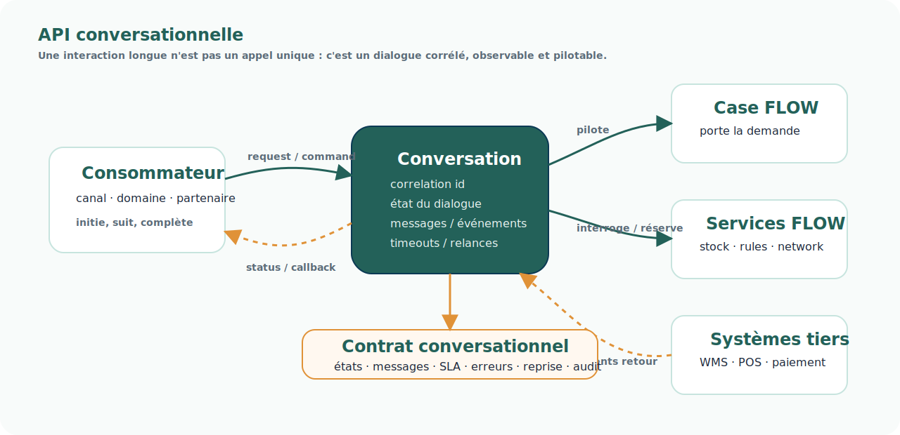

# Pattern — API conversationnelle

## Intention

Une API conversationnelle organise un échange métier comme un dialogue suivi, et non comme un simple appel requête / réponse.

Elle est particulièrement utile lorsqu'une interaction :

- dure dans le temps ;
- traverse plusieurs systèmes ;
- produit plusieurs statuts intermédiaires ;
- nécessite des compléments d'information ;
- peut échouer, expirer, être relancée ou compensée ;
- doit rester corrélée à une demande ou à un Case.



<div class="flow-conviction">
  <p>Une API conversationnelle ne répond pas seulement à une question.</p>
  <p>Elle maintient un dialogue métier corrélé jusqu'à résolution de la demande.</p>
</div>

## Problème adressé

Les APIs classiques sont souvent pensées comme des appels synchrones :

```text
Je demande → tu réponds
```

Ce modèle fonctionne bien pour une consultation simple ou une action courte.

Il devient insuffisant pour les transactions longues de FLOW : réservation, allocation, préparation, paiement, SAV, litige, annulation, remboursement, livraison, retour, demande fournisseur.

Dans ces cas, la réponse immédiate n'est souvent qu'un accusé de réception.

La vraie réponse arrive plus tard, après plusieurs événements, décisions ou interactions avec des systèmes tiers.

## Principe

Une API conversationnelle doit expliciter le contrat du dialogue.

Elle porte notamment :

| Élément | Rôle |
| --- | --- |
| Conversation ID | Identifiant de corrélation du dialogue. |
| Case ID | Lien avec la demande portée par FLOW. |
| Message type | Nature du message : demande, accusé, statut, complément, erreur, décision, résultat. |
| Conversation state | État courant du dialogue. |
| SLA / timeout | Temps attendu avant relance, expiration ou escalade. |
| Callback / event | Mécanisme de retour asynchrone. |
| Idempotency key | Protection contre les doublons. |
| Audit trail | Historique des messages et décisions. |

## Différence avec une API classique

| API classique | API conversationnelle |
| --- | --- |
| Appel ponctuel | Dialogue suivi |
| Réponse immédiate attendue | Réponses intermédiaires et résultat final possibles |
| Faible mémoire du contexte | État de conversation explicite |
| Erreur technique ou fonctionnelle simple | Timeouts, reprises, compensations, relances |
| Corrélation souvent implicite | Corrélation obligatoire |

## Usage dans FLOW

Ce pattern est particulièrement pertinent pour :

- les interactions entre Case et systèmes Supply ;
- la réservation ou l'allocation de stock ;
- les échanges avec WMS, POS, transporteurs ou partenaires ;
- les paiements, captures, remboursements et statuts finance ;
- les échanges SAV ;
- les demandes fournisseurs ;
- l'intégration des systèmes réintégrés comme CBS, C-LOG ou des services spécialisés.

## Exemple simplifié

```text
1. Le Case demande une réservation.
2. Le Stock Unifié accuse réception et ouvre une conversation.
3. Le Stock Unifié publie un statut : réservation en cours.
4. Un système source confirme ou invalide la disponibilité.
5. Le Stock Unifié publie le résultat final.
6. Le Case adapte son plan d'exécution.
```

La conversation permet de suivre tout le dialogue sans perdre le contexte métier.

## Risques

- Appeler “conversationnelle” une API simplement asynchrone.
- Ne pas expliciter les états de conversation.
- Oublier les timeouts, relances, expirations et compensations.
- Ne pas prévoir l'idempotence.
- Ne pas relier la conversation au Case et à l'auditabilité.
- Multiplier les conversations sans gouvernance de contrats.

## Positionnement dans FLOW

L'API conversationnelle complète les autres patterns :

- elle utilise l'Event-Driven Architecture pour les retours asynchrones ;
- elle s'appuie sur le Case pour conserver le contexte métier ;
- elle peut produire des événements exploitables par les Vues 360 ;
- elle facilite l'intégration de systèmes existants sans imposer un appel synchrone fragile.

<div class="flow-conviction">
  <p>Dans FLOW, beaucoup d'interactions ne sont pas des appels.</p>
  <p>Ce sont des conversations opérationnelles qui doivent être suivies, reprises et expliquées.</p>
</div>

## Produits associés

- [Socle Case Management](../produits/socle-case-management.md)
- [Stock Unifié](../produits/stock-unifie.md)
- [Fulfillment Network Configuration](../produits/fulfillment-network-configuration.md)
- [Supply Service Registry](../produits/supply-service-registry.md)
- [Gouvernance des données en transit](../produits/gouvernance-donnees-transit.md)