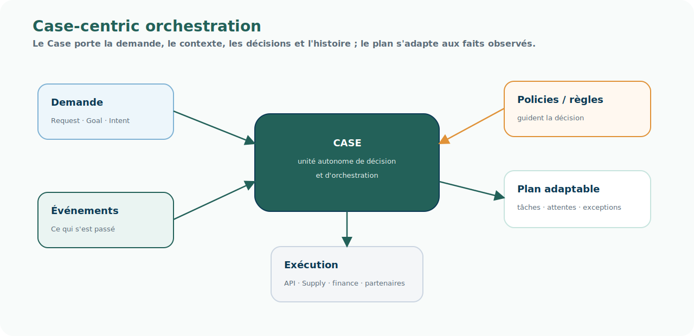

# Pattern — Case-centric orchestration

<!-- FLOW-READING-CARD:START -->

  
Repère de lecture

  

    

      Public cible
      <strong>Architecte, Développeur, Delivery</strong>
    

    

      Temps de lecture
      <strong>2 min</strong>
    

    

      Usage
      <strong>Relier les concepts FLOW aux produits, patterns et responsabilités cible</strong>
    

  

<!-- FLOW-READING-CARD:END -->

## Intention

Le pattern Case-centric orchestration place la Demande au centre de l'orchestration.

Le processus n'est plus le point de départ.

Il émerge progressivement des décisions prises sur le Case, au regard du contexte, des événements, des faits observés, des documents et des policies applicables.

  
Le Case n'exécute pas un processus figé.

  
Il pilote une demande qui s'adapte à ce qui se passe réellement.

## Problème adressé

Les modèles document-centric ou process-centric atteignent leurs limites lorsque :

- les demandes sont longues ;
- les exceptions sont nombreuses ;
- les acteurs changent selon le contexte ;
- les décisions dépendent de faits arrivant en cours d'exécution ;
- le même besoin métier peut traverser plusieurs processus, systèmes ou domaines ;
- l'entreprise doit traiter vente, retour, SAV, achat, exception stock ou demande fournisseur avec une logique comparable.

## Principe

Un Case porte :

- une demande ;
- un demandeur ;
- un objectif ;
- une intention ;
- un état courant ;
- un journal d'événements ;
- des documents ;
- des faits de situation ;
- des décisions ;
- un plan d'exécution adaptable.

La logique métier ne doit pas être codée uniquement dans un workflow.

Le workflow peut exécuter certaines tâches, mais le Case porte le contexte, l'histoire et les décisions.

## Usage dans FLOW

Ce pattern est central pour le **Socle Case Management**.

Il permet d'unifier plusieurs familles de demandes :

- commande client ;
- retour ;
- litige SAV ;
- annulation pour rupture ;
- demande d'achat ;
- exception stock ;
- demande fournisseur ;
- demande de réallocation ou de priorisation.

## Risques

- Recréer un workflow rigide sous un autre nom.
- Mettre trop de logique technique dans les Cases.
- Ne pas gouverner les types de Case créés par les domaines.
- Séparer artificiellement Case, décision, documents et auditabilité.

## Produits associés

- [Socle Case Management](../produits/socle-case-management.md)
- [Vues 360](../produits/vues-360.md)
- [Product Agreement Catalog](../produits/product-agreement-catalog.md)
