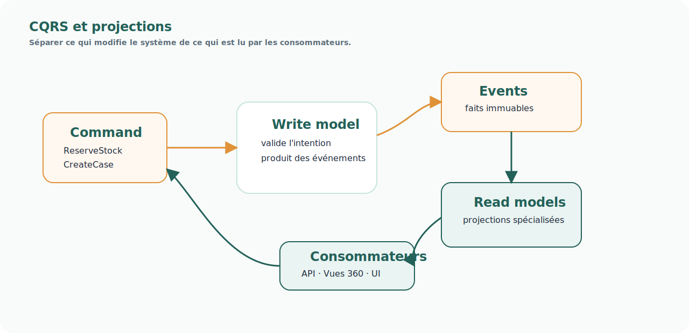

# Pattern — CQRS et projections

<!-- FLOW-READING-CARD:START -->

  
Repère de lecture

  

    

      Public cible
      <strong>Architecture, product owners, delivery</strong>
    

    

      Temps de lecture
      <strong>1 min</strong>
    

    

      Usage
      <strong>Relier les concepts FLOW aux produits, patterns et responsabilités cible</strong>
    

  

<!-- FLOW-READING-CARD:END -->

## Intention

CQRS sépare les actions qui modifient le système des modèles de lecture utilisés par les consommateurs.

  
Le modèle qui décide n'est pas forcément le modèle qui expose.

  
FLOW doit produire des projections adaptées aux usages sans déformer le modèle métier source.

## Problème adressé

Un même modèle de données ne répond pas correctement à tous les usages : transaction, décision, recherche, pilotage, Vue 360, audit, diagnostic.

Lorsque tout est demandé à un seul modèle, on obtient souvent :

- des requêtes complexes ;
- des couplages forts ;
- des performances fragiles ;
- des compromis permanents entre écriture et lecture ;
- des modèles difficiles à faire évoluer.

## Principe

Le système distingue :

- les Commands, qui expriment une intention ;
- le modèle d'écriture, qui valide et produit des événements ;
- les événements, qui décrivent ce qui s'est passé ;
- les projections, qui construisent des modèles de lecture adaptés aux usages.

## Usage dans FLOW

CQRS est particulièrement utile pour :

- le Stock Unifié ;
- les Vues 360 ;
- le Socle Case Management ;
- les catalogues d'exécution ;
- les lectures orientées finance, SAV ou opérations.

## Risques

- Créer trop de projections sans gouvernance.
- Oublier la fraîcheur et la traçabilité des projections.
- Confondre projection et source de référence.
- Sous-estimer l'observabilité nécessaire pour diagnostiquer les écarts.

## Produits associés

- [Stock Unifié](../produits/stock-unifie.md)
- [Vues 360](../produits/vues-360.md)
- [Socle Case Management](../produits/socle-case-management.md)
