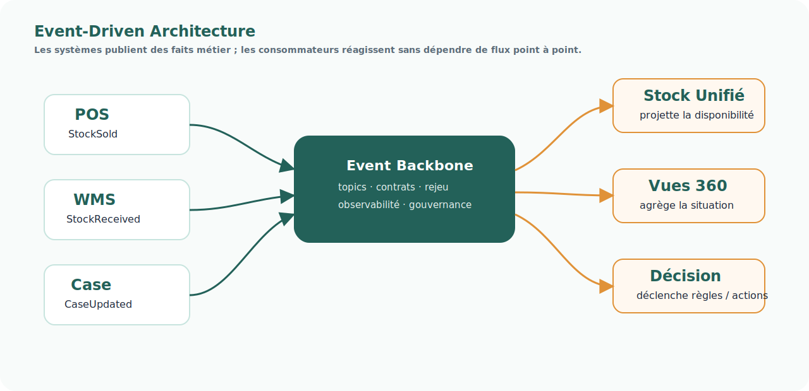

# Pattern — Event-Driven Architecture

## Intention

L'Event-Driven Architecture organise les échanges autour d'événements métier publiés par les systèmes qui observent ou produisent un fait opérationnel.

  
Un événement ne demande pas à un autre système de faire quelque chose.

  
Il déclare qu'une chose significative s'est produite.

## Problème adressé

Les flux projet point à point créent une dépendance forte entre applications, équipes et budgets projet.

Le résultat est souvent :

- des batchs spécifiques ;
- une logique de transformation dispersée ;
- une faible gouvernance des données en transit ;
- des difficultés de diagnostic ;
- une faible capacité de rejeu ;
- une multiplication des flux opportunistes.

## Principe

Les systèmes publient des événements métier stables : StockSold, StockReceived, CaseCreated, ShippingConfirmed, PaymentCaptured.

Les consommateurs s'abonnent aux événements dont ils ont besoin pour maintenir leurs projections, déclencher des décisions ou alimenter des vues opérationnelles.

## Usage dans FLOW

Ce pattern est structurant pour :

- le Socle Case Management ;
- le Stock Unifié ;
- les Vues 360 ;
- la gouvernance des données en transit ;
- l'intégration des systèmes réintégrés.

## Risques

- Publier des événements trop techniques, non métier.
- Confondre événement et commande.
- Ne pas gouverner les contrats d'événements.
- Ne pas prévoir rejeu, idempotence, observabilité et gestion du retard.

## Produits associés

- [Socle Case Management](../produits/socle-case-management.md)
- [Stock Unifié](../produits/stock-unifie.md)
- [Gouvernance des données en transit](../produits/gouvernance-donnees-transit.md)
- [Vues 360](../produits/vues-360.md)