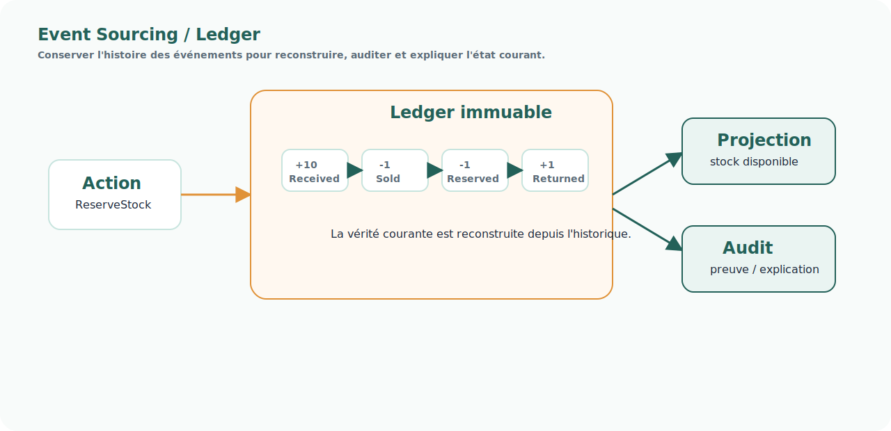

# Pattern — Event Sourcing / Ledger

<!-- FLOW-READING-CARD:START -->
<div class="flow-reading-card">
  <div class="flow-reading-card__title">Repère de lecture</div>
  <div class="flow-reading-card__grid">
    <div>
      <span>Public cible</span>
      <strong>Architecture, product owners, delivery</strong>
    </div>
    <div>
      <span>Temps de lecture</span>
      <strong>1 min</strong>
    </div>
    <div>
      <span>Usage</span>
      <strong>Relier les concepts FLOW aux produits, patterns et responsabilités cible</strong>
    </div>
  </div>
</div>
<!-- FLOW-READING-CARD:END -->

## Intention

Event Sourcing / Ledger consiste à conserver l'historique des événements ou mouvements qui expliquent un état.

Au lieu de ne stocker que la situation courante, le système conserve la trace de ce qui a conduit à cette situation.



<div class="flow-conviction">
  <p>Un état courant dit où l'on est.</p>
  <p>Un ledger explique comment on y est arrivé.</p>
</div>

## Problème adressé

FLOW doit expliquer des décisions, des promesses, des réservations, des allocations ou des changements de statut.

Sans historique fiable, il devient difficile de :

- reconstruire un état ;
- diagnostiquer un écart ;
- auditer une décision ;
- réconcilier plusieurs systèmes ;
- comprendre pourquoi une promesse a été faite.

## Principe

Le système enregistre des événements immuables et horodatés.

Des projections de lecture sont ensuite construites à partir de ce journal.

Exemple stock :

```text
+10 réception
-1 vente
-1 réservation
+1 retour
-2 casse
```

## Usage dans FLOW

Ce pattern est particulièrement adapté :

- au Stock Unifié ;
- à l'Event log d'un Case ;
- aux réservations et allocations ;
- aux faits nécessaires à la finance, au contrôle et à l'audit.

## Risques

- Confondre ledger et modèle de lecture.
- Ne pas prévoir les corrections et compensations.
- Sous-estimer le volume d'événements.
- Ne pas gouverner les règles de reconstruction.

## Produits associés

- [Stock Unifié](../produits/stock-unifie.md)
- [Socle Case Management](../produits/socle-case-management.md)
