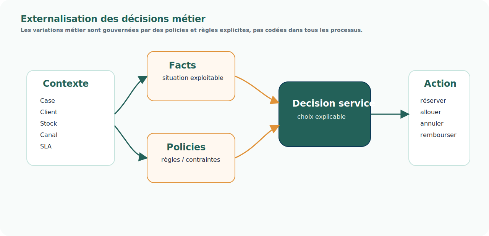

# Pattern — Externalisation des décisions

## Intention

L'externalisation des décisions consiste à sortir les règles, policies, paramètres et contraintes métier des processus figés et du code applicatif dispersé.

  
La variation métier ne doit pas faire exploser les processus.

  
Elle doit être gouvernée par des décisions explicites.

## Problème adressé

Dans un SI omnicanal, les variations sont nombreuses : canal, marque, client, priorité commerciale, stock, saison, SLA, fiscalité, pays, service logistique.

Si ces variations sont codées dans les processus, chaque exception devient une branche supplémentaire.

## Principe

Le système distingue :

- le Case qui porte la demande ;
- les faits qui décrivent la situation ;
- les policies qui expriment les choix métier ;
- les règles ou moteurs de décision qui produisent un choix ;
- le workflow ou les systèmes d'exécution qui appliquent ce choix.

## Usage dans FLOW

Ce pattern est structurant pour :

- le Socle Case Management ;
- le Product Agreement Catalog ;
- le Stock Unifié ;
- les règles d'allocation, réservation, priorisation et promesse ;
- la gestion des variations par marque, canal ou client.

## Risques

- Créer un moteur de règles sans gouvernance métier.
- Déporter trop de logique dans des règles illisibles.
- Ne pas tracer les faits utilisés pour décider.
- Ne pas expliquer la décision produite.

## Produits associés

- [Socle Case Management](../produits/socle-case-management.md)
- [Product Agreement Catalog](../produits/product-agreement-catalog.md)
- [Stock Unifié](../produits/stock-unifie.md)