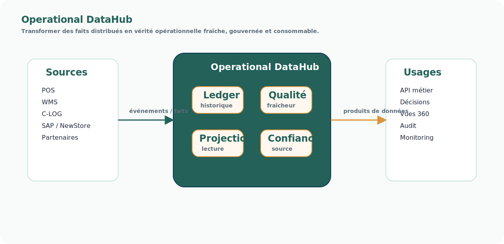

# Pattern — Operational DataHub

<!-- FLOW-READING-CARD:START -->

  
Repère de lecture

  

    

      Public cible
      <strong>Architecte, Développeur, Delivery</strong>
    

    

      Temps de lecture
      <strong>2 min</strong>
    

    

      Usage
      <strong>Relier les concepts FLOW aux produits, patterns et responsabilités cible</strong>
    

  

<!-- FLOW-READING-CARD:END -->

## Intention

Un Operational DataHub construit une vérité opérationnelle fraîche, gouvernée et consommable par les applications.

Il ne s'agit pas d'un entrepôt analytique.

Il collecte des événements ou faits opérationnels, maintient des projections fiables, expose leur fraîcheur et rend la donnée utilisable dans les décisions.

  
Un Operational DataHub ne copie pas seulement des données.

  
Il transforme des faits distribués en capacité opérationnelle gouvernée.

## Problème adressé

Dans un SI distribué, plusieurs systèmes portent une partie de la vérité.

Sans hub opérationnel, les consommateurs doivent composer eux-mêmes avec :

- des sources de référence multiples ;
- des cadences de mise à jour différentes ;
- des écarts de cohérence ;
- une fraîcheur incertaine ;
- des transformations non gouvernées ;
- des flux projet opportunistes.

## Principe

L'Operational DataHub sépare :

- la collecte des faits ;
- la construction des projections ;
- la qualification de fraîcheur et de confiance ;
- l'exposition par API, événements ou vues ;
- la réconciliation et l'observabilité.

## Usage dans FLOW

Ce pattern est central pour le [Stock Unifié](../produits/stock-unifie.md).

Il peut aussi servir à structurer certaines Vues 360 ou capacités de données en transit.

## Risques

- Le réduire à un simple miroir de bases applicatives.
- Ne pas qualifier la fraîcheur et les sources de référence.
- Créer une vérité centrale trop lente pour les décisions opérationnelles.
- Mélanger usages opérationnels et analytiques sans gouvernance.

## Produits associés

- [Stock Unifié](../produits/stock-unifie.md)
- [Vues 360](../produits/vues-360.md)
- [Gouvernance des données en transit](../produits/gouvernance-donnees-transit.md)
- [Sources de référence, projections et vues](sources-reference-projections-vues.md)
