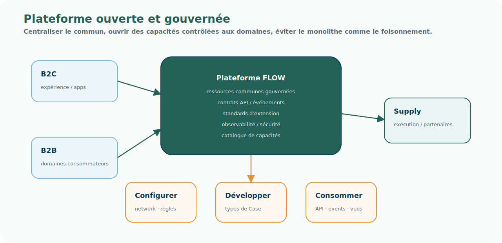

# Pattern — Plateforme ouverte et gouvernée

<!-- FLOW-READING-CARD:START -->

  
Repère de lecture

  

    

      Public cible
      <strong>Architecture, product owners, delivery</strong>
    

    

      Temps de lecture
      <strong>1 min</strong>
    

    

      Usage
      <strong>Relier les concepts FLOW aux produits, patterns et responsabilités cible</strong>
    

  

<!-- FLOW-READING-CARD:END -->

## Intention

Une plateforme ouverte et gouvernée centralise certaines ressources critiques, tout en exposant des capacités contrôlées à des domaines consommateurs.

Elle n'est donc ni un monolithe fermé, ni un simple ensemble d'APIs sans gouvernance.

  
Une plateforme gouverne le commun.

  
Une plateforme ouverte permet aux domaines de construire autour du commun sans recréer des silos.

## Problème adressé

FLOW doit créer du commun sans écraser les singularités utiles des marques, canaux ou domaines.

Le risque serait double :

- tout centraliser et rigidifier l'entreprise ;
- tout laisser autonome et conserver les incohérences actuelles.

## Principe

La plateforme porte :

- des ressources communes ;
- des contrats d'API et d'événements ;
- une gouvernance d'accès ;
- des standards d'extension ;
- des mécanismes d'observabilité ;
- un cadre permettant aux domaines de configurer ou développer sans casser le commun.

## Usage dans FLOW

Ce pattern décrit le modèle général de la plateforme FLOW.

Il s'applique notamment :

- au développement de nouveaux types de Case ;
- à la configuration du Réseau d'Exécution ;
- aux règles et decisions ;
- aux projections ;
- aux intégrations de systèmes conservés.

## Risques

- Ouvrir sans gouverner.
- Gouverner en bloquant toute autonomie.
- Confondre plateforme et application centrale.
- Ne pas définir les contrats d'extension.

## Produits associés

- [Socle Case Management](../produits/socle-case-management.md)
- [Fulfillment Network Configuration](../produits/fulfillment-network-configuration.md)
- [Supply Service Registry](../produits/supply-service-registry.md)
- [Gouvernance des données en transit](../produits/gouvernance-donnees-transit.md)
