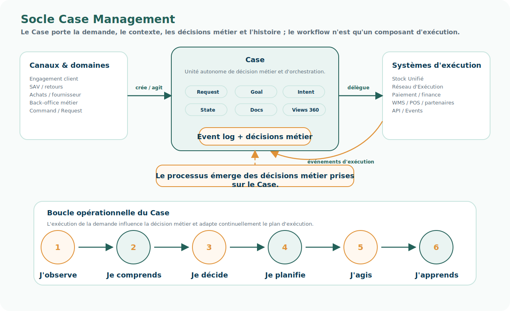

# Fiche produit — Socle Case Management

<!-- FLOW-READING-CARD:START -->
<div class="flow-reading-card">
  <div class="flow-reading-card__title">Repère de lecture</div>
  <div class="flow-reading-card__grid">
    <div>
      <span>Public cible</span>
      <strong>Architecte, Développeur, Delivery</strong>
    </div>
    <div>
      <span>Temps de lecture</span>
      <strong>15 min</strong>
    </div>
    <div>
      <span>Usage</span>
      <strong>Relier les concepts FLOW aux produits, patterns et responsabilités cible</strong>
    </div>
  </div>
</div>
<!-- FLOW-READING-CARD:END -->

## Intention

Le Socle Case Management fournit le cœur applicatif permettant de modéliser, piloter et faire évoluer les demandes dans la durée.

Il ne s'agit pas seulement d'un moteur de workflow.

Il doit être pensé comme un socle orienté PaaS : un ensemble de services techniques et métier, mais aussi un framework permettant aux équipes de développer en autonomie des Cases, règles, paramétrages, événements et extensions gouvernées.

Le produit doit permettre de construire des objets métier de type Case, capables de porter une intention, un contexte, des décisions métier, des événements, des documents, des ressources mobilisées et un état courant.

<div class="flow-conviction">
  <p>Le Case est l'unité autonome de décision et d'orchestration.</p>
  <p>Le socle fournit le runtime, mais ce sont les Cases qui portent la logique métier.</p>
</div>

## Schéma produit



## Pourquoi un socle Case Management ?

Le Case Management répond à une limite des modèles classiques d'orchestration.

Dans un modèle <span class="flow-keyword">document-centric</span>, typique des grands ERP, le processus métier est implicite dans le graphe des documents et des transactions.

```text
Sales Order → Delivery → Invoice
```

Ce modèle est robuste pour la cohérence transactionnelle, mais il rend le processus d'entreprise structurellement difficile à modifier. Le périmètre de décision reste centré sur la transaction.

Dans un modèle <span class="flow-keyword">process-centric</span>, typique BPMN, le processus devient explicite et configurable.

```text
Initialiser → Vérifier disponibilité → Valider → Préparer → Livrer
```

Ce modèle rend l'organisation plus visible, mais le processus reste largement prédéfini. Il est configurable, mais il demeure fixe au moment de l'exécution.

Le modèle <span class="flow-keyword">case-centric</span> introduit une rupture : le processus n'est plus le point de départ. Il émerge des décisions métier prises sur une demande, au regard de son contexte, des faits observés, des règles métier et des événements d'exécution.

<div class="flow-conviction">
  <p>Le processus émerge des décisions métier prises sur le Case.</p>
  <p>L'exécution de la demande influence la décision métier et adapte continuellement le plan d'exécution.</p>
</div>

## Modèles d'orchestration comparés

| Modèle | Point de départ | Processus | Périmètre de décision | Limite principale |
| --- | --- | --- | --- | --- |
| Document-centric | Document / transaction | Implicite dans le graphe documentaire | Transaction | Processus structurellement difficile à modifier. |
| Process-centric | Processus BPMN | Explicite et configurable | Processus | Processus visible mais fixé par conception. |
| Case-centric | Demande / Case | Émergent et adaptable | Environnement de la demande | Nécessite une gouvernance forte des décisions métier, événements et règles. |

Cette comparaison est structurante pour FLOW.

FLOW ne cherche pas seulement à remplacer un OMS ou un ERP par un autre outil. Il déplace le centre de gravité de l'orchestration vers la <span class="flow-keyword">Demande</span>.

## Lien avec Demand, Fulfillment et Supply

Le Socle Case Management est le point où les concepts de domaine deviennent opérables dans une solution.

Il ne remplace pas à lui seul Demand, Fulfillment et Supply.

Il fournit le runtime qui permet à une demande de porter son contexte, d'appeler les décisions de Fulfillment et de dialoguer avec les capacités Supply.

| Notion de domaine | Traduction dans le Socle Case Management | Produits ou capacités associés |
| --- | --- | --- |
| Demand | Le Case porte l'intention, l'engagement, le contexte, la priorité, l'état courant et l'historique de la demande. | Socle Case Management, APIs de création et d'action, cycle de vie du Case |
| Fulfillment | Les décisions métier déterminent comment servir la demande : promettre, réserver, allouer, splitter, reporter, substituer ou ouvrir une exception. | Moteur de règles, Decision Services, Situation Engine, plan d'exécution |
| Supply | Les ressources et contraintes sont consommées comme faits, projections, services ou événements d'exécution. | Stock Unifié, Fulfillment Network, Supply Service Registry, systèmes d'exécution |

Cette lecture évite deux confusions.

Le Case n'est pas seulement une commande enrichie : il porte la demande et son histoire.

Le Fulfillment n'est pas seulement la logistique : il est la décision qui relie la demande aux ressources mobilisables.

## Boucle opérationnelle du Case

Un Case doit pouvoir apprendre de ce qui se passe pendant son exécution.

La boucle cible peut être exprimée ainsi :

```text
J'observe
    ↓
Je comprends
    ↓
Je décide
    ↓
Je planifie
    ↓
J'agis
    ↓
J'apprends
```

Cette boucle articule plusieurs composants :

- les événements qui décrivent ce qui s'est passé ;
- les faits qui rendent la situation exploitable pour décider ;
- les policies et règles qui guident la décision métier ;
- le plan d'orchestration qui organise l'action ;
- les systèmes d'exécution qui réalisent les opérations ;
- les retours d'exécution qui adaptent le Case.

## Modèle conceptuel minimal d'un Case

Un Case représente une demande à instruire dans la durée.

Il doit porter au minimum :

| Élément | Rôle |
| --- | --- |
| Request | Expression de la demande, proche d'une user story métier. |
| Requester | Personne, système, client, fournisseur ou organisation qui demande. |
| Goal | Résultat attendu. |
| Intent | Intention ou raison métier de la demande. |
| Policy model | Ensemble des règles, contraintes et politiques applicables. |
| Fulfillment decision | Décision qui détermine comment servir la demande dans un contexte donné. |
| Execution plan | Trajectoire d'exécution retenue, éventuellement adaptée au fil des événements. |
| State | État courant de la demande. |
| Event log | Historique immuable de ce qui s'est passé. |
| Attachments | Documents attachés : facture, bon de livraison, preuve, justificatif, échange client. |
| Aggregate views / Vues 360 | Lectures agrégées utiles autour du Case, du client, de la commande ou du fournisseur. |
| Statistics | Indicateurs d'exécution, durée, exceptions, qualité ou performance. |

Ce modèle doit rester générique : le Case peut représenter une commande client, un retour, un litige SAV, une demande fournisseur, une exception stock ou une demande d'achat.

## Responsabilités portées

- Modéliser les types de demandes / Cases.
- Porter le cycle de vie d'une demande dans la durée.
- Enregistrer les décisions métier, événements, statuts, documents et faits associés.
- Orchestrer les interactions avec les produits FLOW et les systèmes externes.
- Supporter les transactions longues, exceptions, retours, SAV, commandes et demandes fournisseur.
- Permettre la traçabilité et l'explicabilité d'une demande.
- Fournir un cadre contrôlé pour développer de nouveaux types de Case.
- Adapter le plan d'exécution au fil des événements et des faits observés.
- Déléguer l'organisation opérationnelle à des API, systèmes d'exécution, IAM / IDP et applications satellites.

## Ce que le produit ne porte pas

- Les expériences client ou interfaces d'engagement.
- Les opérations physiques de stock, entrepôt, magasin ou transport.
- La comptabilité et les écritures financières.
- Le PLM, le PIM complet ou le CRM.
- Les règles métier globales lorsqu'elles appartiennent à un domaine spécialisé hors FLOW.
- Les systèmes spécialisés qui exécutent une tâche opérationnelle mais ne portent pas la demande.

## Consommateurs et contributeurs

| Acteur | Usage attendu |
| --- | --- |
| Canaux d'engagement | Créer ou suivre une demande. |
| Services client / SAV | Piloter litiges, retours, remboursements ou exceptions. |
| Produits FLOW | Fournir décisions métier, stock, promesse, réseau d'exécution ou projections. |
| Supply | Recevoir des besoins d'exécution et publier des événements. |
| Finance | Consommer faits, statuts, documents ou références nécessaires à la comptabilité. |
| IAM / IDP / API Gateway | Sécuriser délégations, accès et interactions externes. |
| PO / équipes domaine | Développer de nouveaux types de Case selon un cadre contrôlé. |

## Informations clés

| Information | Nature | Statut probable |
| --- | --- | --- |
| Case | Objet métier | Source de référence FLOW |
| Request | Command / Objet métier | Source de référence consommateur, traitée par FLOW |
| Requester | Projection / Objet métier selon domaine | Source de référence externe ou projection FLOW |
| Goal / Intent | Fact / Policy selon usage | Source de référence FLOW |
| Command de création / action | Command | Source de référence consommateur, traitée par FLOW |
| Événement de Case | Event | Source de référence FLOW |
| Event log | Event | Source de référence FLOW |
| Fact de situation | Fact | Dérivé FLOW ou projection consommée |
| Décision métier de Case | Decision / Fact | Source de référence FLOW ou projection |
| Décision de Fulfillment | Decision | Source de référence FLOW |
| Plan d'exécution | Fact / Projection | Dérivé FLOW, adapté selon événements |
| Policy model | Policy | Source de référence FLOW ou projection selon gouvernance |
| Document attaché | Document | Source de référence ou projection selon origine |
| Statut de Case | Fact / Nomenclature | Source de référence FLOW |
| Contexte client / fournisseur / produit | Projection | Projection FLOW |
| Vue 360 | Projection | Dérivé FLOW |

Les décisions de Case Management ne sont pas autonomes.

Elles s'appuient sur des projections issues de domaines responsables, avec un ownership explicite.

| Domaine contributeur | Informations ou règles consommées par la décision | Usage dans le Case |
| --- | --- | --- |
| SRM | Fournisseur, usine / site de production, relation fournisseur-usine, habilitations, Agreement selon périmètre | Identifier le bon acteur opérationnel et les droits applicables |
| PLM | Contrats ou éléments d'Agreement négociés pendant la conception produit | Comprendre les conditions utiles à l'achat, à la promesse ou à l'exécution |
| Module Négoce | Conditions commerciales, commandes d'achat, contexte d'assortiment ou d'approvisionnement | Relier engagement commercial, achat et disponibilité future |
| Finance | Règles de facturation, entités juridiques, contraintes documentaires | Vérifier les obligations économiques ou documentaires liées au Case |
| Supply / exécution | Lead times, capacités, contraintes transport, disponibilité future | Calculer une promesse et orienter l'exécution |

Le produit Case Management doit donc consommer des informations qualifiées, pas redéfinir seul les sources d'autorité.

## Décision métier, événement et fait

Le Case Management doit distinguer explicitement trois notions.

| Notion | Définition opérationnelle | Exemple |
| --- | --- | --- |
| Event | Quelque chose qui s'est passé, immuable, horodaté et explicite. | ShippingConfirmed, StockReserved, PaymentCaptured. |
| Fact | Information exploitable pour prendre une décision métier, souvent dérivée d'un ou plusieurs événements. | Le stock disponible est insuffisant ; le client est prioritaire ; la livraison est en retard. |
| Decision | Choix métier effectué dans un contexte donné, guidé par des policies, règles ou contraintes. | Choisir SFS plutôt que entrepôt ; annuler une ligne ; déclencher un remboursement. |

Cette distinction évite de coder la logique métier directement dans un processus figé.

La décision métier est guidée par la <span class="flow-keyword">Business Policy</span> plutôt que codée dans les enchaînements de tâches.

## Capacités à instruire

- Définir un type de Case.
- Créer un Case.
- Piloter son cycle de vie.
- Attacher un document.
- Enregistrer une décision métier.
- Générer ou consommer des faits de situation.
- Publier un événement de changement d'état.
- Adapter le plan d'exécution en fonction des événements.
- Corréler un Case avec une commande, un client, un fournisseur ou une exécution.
- Rejouer ou reconstruire l'histoire d'un Case.
- Exposer une lecture Case 360.
- Gérer les exceptions et escalades.
- Déléguer des tâches à des systèmes d'exécution via API.

## Interfaces à instruire

- API de création de Case.
- API de consultation de Case.
- API d'action sur Case.
- API de publication ou réception de documents.
- API d'explication de décision métier.
- Événements publiés : CaseCreated, CaseUpdated, CaseDecisionTaken, CaseStatusChanged, CasePlanAdapted, CaseClosed.
- Événements consommés : stock movement, allocation result, supply status, shipping confirmation, document received, payment / finance status, customer notification status.
- Intégration avec moteur de règles, workflow, CEP, IAM / IDP, API Gateway et produits FLOW.

## Architecture du socle à instruire

Le socle peut combiner plusieurs composants spécialisés.

| Composant | Rôle probable |
| --- | --- |
| Framework de développement de Case | Permettre de créer des objets métier Case robustes, extensibles et gouvernés. |
| Moteur de règles | Évaluer policies, règles, conditions et décisions métier. |
| CEP / Situation Engine | Transformer événements et signaux en faits exploitables par les décisions métier. |
| Moteur de workflow / orchestration | Piloter les tâches longues, compensations, attentes et interactions systèmes. |
| Event log | Historiser l'exécution et permettre audit, reconstruction et explication. |
| API sécurisées | Exposer les actions de Case aux domaines consommateurs et applications satellites. |
| Vues 360 | Agréger l'information autour du Case, du client, de la commande ou du fournisseur. |

Cette architecture doit éviter une confusion : le moteur de workflow n'est qu'un composant du socle. Il ne doit pas redevenir le centre du modèle.

<div class="flow-conviction">
  <p>Le workflow exécute une partie du plan.</p>
  <p>Le Case porte la demande, le contexte, les décisions métier et l'histoire.</p>
</div>

## Proposition technique à évaluer

Cette fiche ne constitue pas encore un choix d'architecture technique.

Elle propose néanmoins une hypothèse de construction réaliste, plutôt open source et maîtrisable, pour initialiser un prototype du Socle Case Management.

<div class="flow-conviction">
  <p>La technologie ne doit pas ramener FLOW vers un modèle process-centric.</p>
  <p>Le cœur technique doit rester le Case, pas le workflow.</p>
</div>

La combinaison la plus cohérente à explorer est :

| Besoin | Candidat technique | Rôle dans le socle |
| --- | --- | --- |
| Développer les objets Case | Spring Boot / Java ou Kotlin | Construire les agrégats Case, APIs, règles d'invariants, intégrations et extensions domaine. |
| Orchestrer les tâches longues | Temporal | Gérer attentes, retries, timers, compensations, appels asynchrones et conversations longues avec les systèmes externes. |
| Exécuter les décisions métier | Drools / DMN / Decision Services | Évaluer règles, policies, critères de choix, priorités et décisions explicables. |
| Produire des faits à partir d'événements | Drools CEP / Situation Engine dédié | Transformer des événements opérationnels en faits exploitables par le Case. |
| Publier et consommer les événements | Kafka, Redpanda ou équivalent | Diffuser les événements de Case, d'exécution, de stock et de statut. |
| Persister l'état et l'historique | PostgreSQL + event log dédié | Conserver l'état courant, l'historique, les documents de référence et les traces d'audit. |
| Exposer et sécuriser les interactions | API Gateway + IAM / IDP, par exemple Keycloak | Contrôler les accès, délégations, scopes consommateurs et appels machine-to-machine. |
| Observer et diagnostiquer | OpenTelemetry + logs / métriques / traces | Comprendre les décisions, workflows, délais, retries, erreurs et écarts de cohérence. |

Cette architecture garde une séparation nette :

```text
Spring Boot
    → porte le modèle Case et les APIs métier

Temporal
    → orchestre les tâches longues et interactions asynchrones

Drools / Decision Services
    → produit les décisions métier explicables

CEP / Situation Engine
    → transforme des événements en faits

Event bus
    → diffuse les événements et alimente les projections
```

L'intérêt de cette approche est de ne pas confondre quatre responsabilités :

- le Case, qui porte la demande et sa cohérence ;
- la décision métier, qui produit un choix explicable ;
- le workflow, qui exécute ou attend des actions ;
- l'événement, qui décrit ce qui s'est réellement passé.

## Lecture des options techniques

Plusieurs options doivent être comparées avant arbitrage.

| Option | Intérêt | Risque principal | Lecture FLOW |
| --- | --- | --- | --- |
| Spring Boot + Temporal + Drools | Forte maîtrise, coût licence faible, modèle Case réellement sur mesure, bonne séparation Case / workflow / décision. | Effort de construction produit plus élevé ; besoin d'une vraie discipline d'architecture, d'observabilité et de tests de règles. | Option recommandée pour un prototype sérieux du socle. |
| Camunda | Très bon outillage BPMN / DMN, lisibilité des processus, maturité sur l'orchestration métier. | Risque de revenir à un modèle process-centric où le workflow redevient le centre du design. Modèle de licence et coûts à analyser selon l'édition retenue. | À considérer pour orchestrer certains processus explicites, mais pas comme cœur naturel du Case Management FLOW. |
| NewStore élargi | Produit déjà présent chez BRD, proche de certains besoins OMS : commande, stock, promesse, SFS, notification, paiement, SAV. | Risque de prendre un OMS comme socle Demand général. Couverture incertaine des Cases achat, fournisseur, litige transverse, données en transit et gouvernance multi-domaines. | À utiliser comme source d'apprentissage ou trajectoire de transition, pas comme socle cible élargi par défaut. |
| Solution Case Management du marché | Accélération possible si le produit porte nativement Case, rules, documents, audit, APIs et extensibilité. | Risque de verrouillage éditeur, coût, adaptation excessive ou modèle conceptuel imposé. | À benchmarker si un produit démontre une vraie approche case-centric et ouverte. |

## Position recommandée à ce stade

La recommandation d'architecture est de ne pas démarrer par NewStore ou Camunda comme socle cible.

Ces solutions peuvent être utiles, mais elles portent chacune un biais :

- NewStore pousse naturellement vers une lecture OMS et commande.
- Camunda pousse naturellement vers une lecture processus et workflow.

Or FLOW cherche précisément à déplacer le centre de gravité vers la Demande et le Case.

La cible la plus alignée est donc un socle case-centric construit autour d'un modèle métier maîtrisé, avec des composants spécialisés autour :

```text
Case d'abord
    ↓
Décision métier explicite
    ↓
Workflow comme composant d'exécution
    ↓
Événements et faits comme mémoire opérationnelle
```

Spring Boot + Temporal + Drools constitue une bonne hypothèse de départ parce que cette combinaison permet de construire un socle modulaire, plutôt gratuit en licences logicielles, sans imposer un progiciel unique comme modèle de pensée.

Cette gratuité doit toutefois être comprise correctement : elle réduit le coût de licence, mais elle augmente l'importance de l'ingénierie produit, de l'exploitation, des tests, de la documentation et de la gouvernance technique.

## Points de vigilance techniques

Cette hypothèse doit être validée par prototype.

Les points à tester en priorité sont :

- Capacité à modéliser plusieurs types de Case sans dupliquer le socle.
- Séparation stricte entre état du Case, décisions métier, workflows et événements.
- Traçabilité d'une décision métier : faits utilisés, règle appliquée, version de policy, résultat produit.
- Capacité CEP : transformer des événements de stock, paiement, supply ou document en faits utilisables.
- Robustesse Temporal : retries, timers, compensation, attente d'événements externes, reprise après incident.
- Versioning des règles et rejouabilité des décisions.
- Intégration avec les systèmes existants par API conversationnelle et événements.
- Observabilité de bout en bout : Case, workflow, décision, événement, appel externe.
- Capacité des équipes domaine à contribuer sans fragiliser le socle.

## Premiers choix à instruire

Avant de figer la cible, il faut instruire quelques choix.

| Question | Pourquoi c'est structurant |
| --- | --- |
| Le moteur de décision doit-il être Drools, DMN, un moteur maison léger ou une combinaison ? | Le besoin varie entre règles simples, tables de décision, policies et optimisation. |
| Le CEP doit-il être porté par Drools Fusion, par un moteur de stream processing ou par un Situation Engine développé dans FLOW ? | Les faits doivent être fiables, explicables et rejouables. |
| Temporal doit-il orchestrer tous les plans d'action ou seulement les tâches longues et interactions externes ? | Le workflow ne doit pas redevenir le modèle métier principal. |
| Les Cases sont-ils développés uniquement par l'équipe plateforme ou aussi par des équipes domaine dans un cadre contrôlé ? | C'est le cœur du modèle plateforme ouverte et gouvernée. |
| Quel niveau de standardisation impose-t-on aux événements de Case ? | Les Vues 360, l'auditabilité et les projections en dépendent. |
| Où s'arrête le Socle Case Management et où commencent Stock Unifié, Réseau d'Exécution et Product Agreement Catalog ? | La séparation des produits FLOW doit rester lisible pour les PO / PM. |

## Impacts produit pour FLOW

Le Socle Case Management doit permettre de traiter toutes les demandes métier, au-delà de la seule vente.

Exemples de familles de Case candidates :

- commande client ;
- retour ;
- litige SAV ;
- remboursement ;
- annulation pour rupture ;
- demande d'achat ;
- exception stock ;
- demande fournisseur ;
- demande de réallocation ou de priorisation.

Chaque demande doit être traitée comme un petit projet : elle a un objectif, un contexte, des décisions métier, des événements, des documents, des acteurs, un plan d'action et une histoire.

## Premiers epics backlog

1. Définir le modèle minimal de Case.
2. Définir le cycle de vie standard d'un Case.
3. Créer un premier type de Case pilote.
4. Gérer documents et pièces attachées.
5. Publier les événements de Case.
6. Consommer une décision métier de stock / promesse.
7. Exposer une vue de suivi opérationnel du Case.
8. Définir les mécanismes de corrélation avec systèmes externes.
9. Poser les règles d'auditabilité et d'historisation.
10. Définir le cadre d'extension par les domaines consommateurs.
11. Prototyper la boucle observer / comprendre / décider / agir sur un cas réel.
12. Définir le Situation Engine minimal permettant de produire des faits à partir d'événements.
13. Définir les contrats entre Case, moteur de règles, workflow et systèmes d'exécution.
14. Définir les règles d'explication : pourquoi telle décision métier a été prise, sur quels faits et selon quelles policies.
15. Prototyper un Case Spring Boot avec état, event log, documents attachés et APIs.
16. Prototyper une orchestration Temporal sur une transaction longue avec attente d'événement externe.
17. Prototyper une décision métier Drools / DMN avec version de règle et trace d'explication.
18. Prototyper une transformation CEP : événements entrants → faits de situation → décision métier.
19. Comparer Camunda sur un scénario équivalent afin de vérifier s'il reste un composant d'orchestration ou s'il reprend le centre du modèle.
20. Documenter ce que NewStore sait déjà faire et ce qui ne doit pas être repris tel quel dans le socle Case Management.

## Questions ouvertes

- Quels types de Case doivent être pilotes : commande, retour, SAV, commande d'achat, exception stock ?
- Quel niveau de standardisation du cycle de vie est acceptable ?
- Comment séparer la logique Case du moteur de workflow ?
- Où sont exécutées les règles : dans le Case, dans un service de décision métier ou dans les domaines ?
- Quelles responsabilités restent dans les systèmes existants réintégrés ?
- Jusqu'où le Case doit-il porter le plan d'exécution, et où commence le rôle des systèmes Supply ?
- Quel modèle d'auditabilité faut-il pour réconcilier Case Management, DataHub, finance et Vues 360 ?
- Comment sécuriser la délégation aux applications satellites sans recréer des silos ?
- Quel niveau d'autonomie donner aux domaines pour créer de nouveaux types de Case ?
