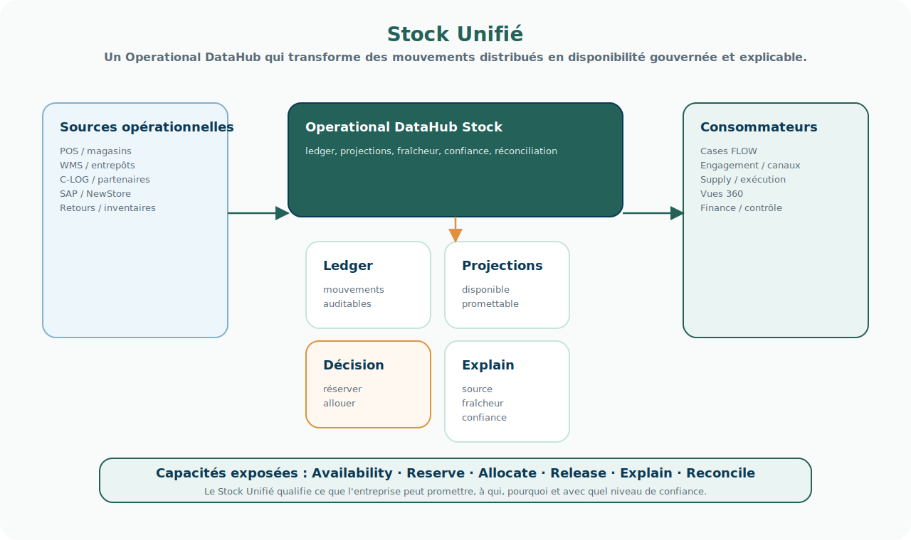

# Fiche produit — Stock Unifié

<!-- FLOW-READING-CARD:START -->
<div class="flow-reading-card">
  <div class="flow-reading-card__title">Repère de lecture</div>
  <div class="flow-reading-card__grid">
    <div>
      <span>Public cible</span>
      <strong>Architecte, Développeur, Delivery</strong>
    </div>
    <div>
      <span>Temps de lecture</span>
      <strong>8 min</strong>
    </div>
    <div>
      <span>Usage</span>
      <strong>Relier les concepts FLOW aux produits, patterns et responsabilités cible</strong>
    </div>
  </div>
</div>
<!-- FLOW-READING-CARD:END -->

## Intention

Le Stock Unifié rend le stock lisible, actionnable et gouvernable à l'échelle du groupe.

Il ne se limite pas à consolider des quantités.

Il doit permettre de calculer une disponibilité contextualisée, de réserver, d'allouer, de taguer une ressource à une finalité et de publier des faits stock exploitables par les Cases.

La réservation, l'allocation ou le tagging ne doivent pas rester de simples attributs centraux : ces actions doivent pouvoir générer des commandes ou instructions vers les domaines d'exécution, afin que la logistique, les magasins ou les partenaires prennent réellement en compte localement la décision.

<div class="flow-conviction">
  <p>Le stock n'est pas seulement une donnée.</p>
  <p>C'est une capacité d'entreprise pour promettre, réserver, allouer et expliquer.</p>
</div>

## Schéma produit



## Pattern d'architecture

Le Stock Unifié est candidat à un pattern d'<span class="flow-keyword">Operational DataHub</span>.

Il ne doit pas être compris comme un simple entrepôt de données ou comme une copie centralisée des stocks des applications.

Il collecte des événements opérationnels, maintient des projections fraîches et gouvernées, puis expose des capacités utilisées par les Cases, les canaux, la Supply et les systèmes conservés.

```text
Sources opérationnelles
POS / WMS / C-LOG / partenaires / systèmes historiques
        ↓
Operational DataHub Stock
ledger, projections, fraîcheur, confiance, réconciliation
        ↓
Capacités FLOW
availability, reservation, allocation, explanation
```

<div class="flow-conviction">
  <p>Le Stock Unifié ne dit pas seulement combien il reste.</p>
  <p>Il dit ce que l'entreprise peut promettre, à qui, pourquoi, et avec quel niveau de confiance.</p>
</div>

## Responsabilités portées

- Consolider une vision opérationnelle du stock.
- Distinguer stock physique, stock disponible, stock réservé, stock alloué et stock promis.
- Calculer une disponibilité selon un contexte business.
- Gérer réservations et allocations / tagging.
- Consommer les mouvements de stock publiés par POS, WMS, partenaires ou systèmes logistiques.
- Publier des faits stock utilisables par les Cases et Vues 360.
- Permettre la réconciliation en cas d'écart.
- Exposer la fraîcheur, la source et le niveau de confiance des informations de stock.
- Expliquer les décisions de disponibilité, réservation ou allocation.

## Ce que le produit ne porte pas

- Les opérations physiques de magasin, entrepôt ou transport.
- Les WMS, TMS ou POS.
- Les règles commerciales complètes de promesse si elles dépendent d'Agreements hors stock.
- La responsabilité comptable du stock.
- Les interfaces d'engagement client.

## Consommateurs et contributeurs

| Acteur | Usage attendu |
| --- | --- |
| Cases | Demander disponibilité, réservation ou allocation. |
| Engagement / canaux | Afficher une disponibilité contextualisée. |
| Supply / WMS / POS | Publier mouvements et corrections de stock. |
| C-LOG / partenaires logistiques | Publier faits d'exécution, statuts, mouvements et contraintes. |
| Finance / contrôle | Consommer faits, documents et écarts réconciliables. |
| Vues 360 | Afficher stock, réservations, anomalies et historique. |

## Informations clés

| Information | Nature | Statut probable |
| --- | --- | --- |
| Stock physique observé | Fact | Projection FLOW |
| Stock disponible | Fact | Source de référence ou dérivé FLOW |
| Stock promettable | Fact / Decision | Dérivé FLOW |
| Réservation | Objet métier / Fact | Source de référence FLOW |
| Allocation / tagging | Decision / Fact | Source de référence FLOW |
| Mouvement de stock | Event | Projection consommée |
| Écart de stock | Fact | Source de référence ou projection |
| Règle de disponibilité | Policy | Source de référence ou projection selon gouvernance |
| Fraîcheur de stock | Fact | Dérivé FLOW |
| Niveau de confiance | Fact / Policy | Dérivé FLOW |

## Capacités candidates

- Consulter le stock disponible.
- Calculer une disponibilité contextualisée.
- Créer, confirmer, annuler ou expirer une réservation.
- Allouer / taguer du stock à une finalité.
- Consommer les mouvements de stock.
- Publier les changements de disponibilité.
- Réconcilier stock théorique et stock observé.
- Expliquer pourquoi un stock est ou n'est pas disponible.
- Détecter les anomalies de stock ou de flux.
- Qualifier la fraîcheur et la confiance d'une donnée stock.

## Interfaces candidates

- API AvailableToPromise / disponibilité.
- API ReserveStock.
- API AllocateStock / TagStock.
- API ReleaseReservation.
- API ExplainAvailability.
- API StockFreshness / confiance.
- Événements consommés : StockMoved, StockAdjusted, StockReceived, StockSold, StockReturned, StockReserved, StockReleased, InventoryCounted.
- Événements publiés : StockAvailabilityChanged, ReservationCreated, ReservationExpired, AllocationConfirmed, StockAnomalyDetected, StockReconciled.

## Risques structurants

| Risque | Description | Point d'attention |
| --- | --- | --- |
| Confusion entre stock physique et stock promettable | Une quantité observée ne dit pas nécessairement ce qui peut être vendu ou promis. | Distinguer les lectures : physique, disponible, réservé, alloué, promettable, contextualisé. |
| Fraîcheur insuffisante | Une vérité centrale alimentée trop tard devient dangereuse. | Définir des exigences de fraîcheur par usage : vente, SAV, B2B, allocation, reporting. |
| Décision distribuée | Plusieurs systèmes peuvent réserver ou promettre le même stock. | Clarifier l'autorité de réservation, d'allocation et de promesse. |
| Volumétrie élevée | Plusieurs centaines de milliers d'articles multipliés par plusieurs milliers de points de stockage. | Éviter les calculs à la demande sur une matrice complète ; privilégier projections matérialisées et partitionnement. |
| Événements désordonnés ou dupliqués | Les mouvements peuvent arriver en retard, dans le désordre ou plusieurs fois. | Idempotence, horodatage métier, corrélation, versionnement, réconciliation. |
| Écart entre stock théorique et réel | Le terrain produit toujours des écarts : casse, vol, oubli de scan, inventaire, offline magasin. | Assumer l'incertitude : source, fraîcheur, confiance, mécanismes de correction. |
| Dépendance aux systèmes externes | POS, WMS, TMS, partenaires ou filiales doivent émettre les mouvements attendus. | Vérifier les capacités API, event, SLA, rejouabilité et observabilité. |

## Problèmes techniques d'échelle

Le Stock Unifié doit être conçu pour une matrice très large mais probablement creuse : tous les articles ne sont pas présents dans tous les points de stockage.

Les principaux problèmes techniques sont :

- cardinalité article × point de stock × statut × canal × contexte métier ;
- fort volume d'écritures : ventes, retours, réceptions, transferts, réservations, corrections ;
- hot spots sur certaines références, opérations commerciales ou périodes de saison ;
- besoin de réponse rapide pour la promesse et la réservation ;
- traitement des événements en retard, dupliqués ou contradictoires ;
- reconstruction et audit de l'état ayant conduit à une promesse ;
- réconciliation entre projections FLOW et systèmes sources.

L'axe de solution est de séparer le <span class="flow-keyword">ledger</span> des mouvements, les <span class="flow-keyword">projections</span> de lecture et les <span class="flow-keyword">API de décision</span>.

## Algorithmes et patterns à étudier

| Pattern / algorithme | Usage possible | Commentaire d'architecture |
| --- | --- | --- |
| Event sourcing / stock ledger | Historiser tous les mouvements de stock et reconstruire les projections. | Très utile pour auditabilité, explication et réconciliation. |
| Double-entry inventory accounting | Modéliser chaque mouvement comme un transfert entre états ou emplacements. | Évite les mouvements magiques et rapproche stock, logistique et finance. |
| Projections matérialisées | Maintenir des vues prêtes à lire : stock disponible, réservé, alloué, promettable. | Indispensable à grande volumétrie. |
| Réservations avec TTL / lease | Réserver temporairement du stock puis confirmer, renouveler ou expirer. | Utile pour panier, commande, SAV, marketplace, B2B. |
| Allocation comme tagging | Attacher une quantité à une finalité : client prioritaire, lancement, SAV, canal. | Permet de gouverner la rareté plutôt que seulement compter le stock. |
| CEP / corrélation d'événements | Détecter anomalies, écarts, séquences incomplètes, retards ou incohérences. | Drools Fusion, Flink CEP ou Esper sont candidats à étudier. |
| Optimisation sous contraintes | Arbitrer promesse, coût logistique, SLA, priorité client, disponibilité réseau. | À réserver aux décisions complexes ; ne pas mettre un solveur sur chaque consultation simple. |
| Scoring de confiance | Qualifier une disponibilité selon fraîcheur, source, historique d'écarts et fiabilité. | Important pour ne pas prétendre à une vérité parfaite. |

## Technologies open source à étudier

Cette liste n'est pas une recommandation définitive. Elle sert à cadrer les options d'étude.

| Besoin | Technologies candidates | Commentaire |
| --- | --- | --- |
| Event backbone | Apache Kafka, Apache Pulsar, Redpanda, NATS JetStream | Kafka est le standard le plus courant ; Pulsar est intéressant pour multi-tenancy et geo-replication ; NATS peut être étudié pour des échanges plus légers. |
| Stream processing / projections | Apache Flink, Kafka Streams, Apache Spark Structured Streaming, Materialize | Flink est très solide pour état, fenêtres et événements tardifs ; Kafka Streams peut suffire si l'écosystème Kafka domine ; Materialize est intéressant pour vues matérialisées SQL temps réel. |
| CEP métier | Drools Fusion, Flink CEP, Esper | Drools Fusion est cohérent si Drools est retenu pour les règles ; Flink CEP est plus naturel si Flink porte déjà les flux massifs ; Esper est à regarder pour CEP embarqué. |
| Règles métier | Drools, OpenL Tablets, Easy Rules | Drools est puissant mais demande une vraie gouvernance des règles ; les alternatives peuvent suffire pour des règles plus simples. |
| Optimisation | Google OR-Tools, Timefold Solver | Utile pour allocation ou fulfillment complexe ; à isoler des chemins critiques simples. |
| Ledger transactionnel | PostgreSQL partitionné, YugabyteDB, CockroachDB | PostgreSQL est le point de départ naturel ; les bases distribuées sont à étudier si le besoin multi-région ou débit transactionnel l'exige. |
| Stockage distribué haute écriture | Apache Cassandra, ScyllaDB | Candidats si le modèle de requête est très stable et le volume d'écriture très élevé. Attention aux requêtes ad hoc. |
| Lecture analytique opérationnelle | ClickHouse, Apache Pinot, Apache Druid | Utiles pour diagnostic, exploration, monitoring opérationnel et agrégats rapides ; pas forcément comme source transactionnelle. |
| Cache de disponibilité | Valkey, Redis-compatible | À utiliser comme accélérateur de lecture, pas comme vérité de stock. |
| Recherche / investigation | OpenSearch | Utile pour rechercher mouvements, anomalies, traces et événements. |
| Observabilité | OpenTelemetry, Prometheus, Grafana, Loki | Indispensable pour prouver fraîcheur, retard, erreurs, backlogs et qualité des flux. |

## Positionnement de Drools Fusion

Drools Fusion peut aider si le Stock Unifié doit détecter des situations métier à partir de séquences d'événements.

Exemples :

- mouvement de stock reçu sans confirmation d'exécution ;
- réservation créée mais jamais confirmée ni expirée ;
- vente magasin reçue après une allocation incompatible ;
- écart répété sur un même point de stockage ;
- retard de flux dépassant le SLA attendu ;
- annulation ou retour qui ne libère pas correctement la disponibilité.

Le bon usage probable est donc :

- Drools / Drools Fusion pour les règles métier, corrélations et alertes explicables ;
- Flink, Kafka Streams ou Materialize pour les projections stock à gros volume ;
- un ledger transactionnel pour l'audit et la reconstruction ;
- une API Stock Unifié pour exposer availability, reservation, allocation et explanation.

<div class="flow-conviction">
  <p>Drools Fusion est un bon candidat pour comprendre les événements.</p>
  <p>Il ne doit pas devenir par défaut le moteur unique de calcul de toutes les projections stock à grande échelle.</p>
</div>

## Premiers epics backlog

1. Définir le modèle de stock minimal.
2. Définir les sources de mouvements stock prioritaires.
3. Définir les statuts de réservation et allocation.
4. Implémenter un premier calcul de disponibilité contextualisée.
5. Exposer une API de consultation stock.
6. Exposer une API de réservation.
7. Publier les événements de disponibilité.
8. Définir les mécanismes de réconciliation.
9. Définir les exigences de fraîcheur par usage.
10. Définir les règles de preuve et auditabilité du stock.
11. Prototyper un ledger de mouvements et une projection de disponibilité.
12. Étudier un scénario CEP : anomalie, retard, contradiction ou réservation expirée.
13. Étudier les technologies candidates pour event backbone, projections, CEP et stockage.
14. Définir les indicateurs d'observabilité : retard, backlog, fraîcheur, taux d'écart, taux de réconciliation.

## Questions ouvertes

- Le Stock Unifié est-il source de référence de disponibilité ou seulement projection calculée ?
- Quelle fraîcheur minimale est nécessaire par cas d'usage ?
- Quels mouvements doivent être temps réel et lesquels peuvent rester batch ?
- Quelle frontière avec C-LOG, WMS, POS et NewStore / StoreLand pendant la transition ?
- Où placer la décision finale de promesse : Stock Unifié, Case ou service de décision ?
- Quel système a autorité pour créer une réservation ferme ?
- Quelles informations de stock doivent être explicables pour la finance, le contrôle ou l'audit ?
- Quels niveaux de confiance et de fraîcheur sont acceptables selon le canal ou le type de demande ?
- Quel niveau de projection faut-il maintenir : article, variante, point de stock, canal, client, segment, saison ?
