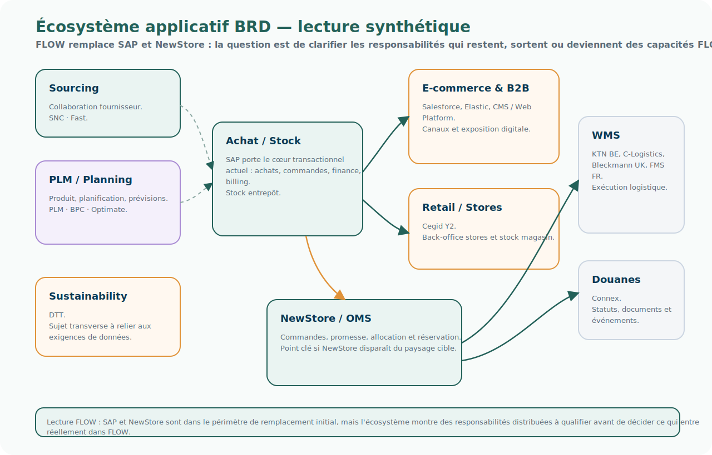

# Panorama applicatif BRD

## Intention

Cette page documente l'environnement IT de Boardriders tel qu'il apparaît dans les supports d'urbanisme du projet, notamment les slides 14, 15 et 16 du document `Urbanisme-ERP-0.1-draft.pptx`.

Ces slides ne décrivent que BRD.

Elles doivent donc être lues comme un panorama spécifique de l'existant BRD, et non comme une comparaison avec GBM.

## Point de départ du projet

Un entrant du projet doit d'abord comprendre le point de départ concret : FLOW est envisagé comme le remplacement de SAP et NewStore sur le périmètre BRD.

La question ouverte n'est donc pas seulement :

> Que doit être FLOW ?

La question initiale est aussi :

> Si FLOW remplace SAP et NewStore, doit-il remplacer autre chose également ?

Cette question oblige à regarder l'environnement applicatif BRD dans son ensemble.

SAP et NewStore ne sont pas isolés. Ils sont connectés à des solutions de planification, de produit, de commerce, de logistique, de stock, de finance, de pilotage et de collaboration fournisseur.

Comprendre BRD consiste donc à identifier :

- ce qui relève directement de SAP ;
- ce qui relève de NewStore ;
- ce qui gravite autour de ces deux socles ;
- ce qui pourrait être repris par FLOW ;
- ce qui doit rester hors FLOW.

## Une lecture déjà urbanisée du SI BRD

La slide 14, rédigée par le responsable SI BRD, ne présente pas seulement des applications isolées.

Les applications y sont placées dans des blocs qui s'apparentent à une lecture d'urbanisme : le SI est représenté selon des zones, des responsabilités ou des ensembles cohérents.

Les blocs visibles sont les suivants :

| Bloc BRD | Applications / composants visibles |
| --- | --- |
| Sourcing | SNC, Fast |
| PLM / Planning | PLM, BPC, Optimate |
| Achat / Stock | SAP |
| E-commerce & B2B | Salesforce, Elastic, CMS / Web platform |
| Sustainability | DTT |
| WMS | KTN BE, C-Logistics, Bleckmann UK, FMS FR |
| Douanes | Connex |
| Cegid Y2 | Cegid Y2 |

Cette observation est importante pour FLOW.

Elle montre que BRD dispose déjà d'une manière de structurer et de raconter son système d'information. Cette manière de voir peut être très utile, mais elle ne doit pas être confondue avec une grille commune à tout le programme.

La lecture BRD mélange naturellement plusieurs types de blocs : des domaines métier, des zones fonctionnelles, des familles applicatives, des partenaires d'exécution et des progiciels structurants. Ce n'est pas un défaut ; c'est souvent ainsi qu'un SI réel est représenté par les équipes qui le pilotent.

Mais pour FLOW, cette lecture doit être traduite dans un urbanisme unifié.

Un point attire particulièrement l'attention : Cegid Y2, qui porte le back-office centralisé des stores retail et le stock magasin, apparaît comme un élément isolé, sans être clairement rattaché à une case d'urbanisme comparable aux autres.

C'est une anomalie de lecture intéressante.

Cegid n'est pas un simple système périphérique : il porte une responsabilité structurante pour le retail, les magasins et la disponibilité de stock. Son positionnement devrait donc être explicité dans un bloc de type `Retail / Store Operations` ou `Store Back-office & Store Inventory`.

Cette situation illustre bien la limite de la lecture actuelle : certains blocs sont des domaines, certains sont des systèmes, certains sont des partenaires ou des zones d'exécution. FLOW devra rendre ces positionnements comparables.

FLOW devra redéfinir un urbanisme commun, capable de rendre comparables les positionnements applicatifs BRD et GBM.

Autrement dit, il faudra pouvoir répondre aux questions suivantes avec les mêmes critères pour les deux groupes :

- dans quel domaine se situe une application ?
- quelle responsabilité porte-t-elle réellement ?
- quelle capacité métier sert-elle ?
- est-elle remplacée, conservée, connectée, encapsulée ou laissée hors périmètre ?
- quelle différence existe entre son positionnement actuel et son positionnement cible ?

Cette grille commune est nécessaire pour éviter que chaque groupe décrive son SI avec ses propres catégories, ce qui rendrait les comparaisons fragiles.

La capture ci-dessous est conservée comme source officielle client. Elle correspond à l'image embarquée dans la slide 14 du support `Urbanisme-ERP-0.1-draft.pptx`.


Le schéma suivant est une synthèse FLOW produite à partir de cette lecture ; il ne remplace pas la source officielle.

## Synthèse visuelle de l'écosystème BRD



## Lecture globale

Le panorama BRD peut être lu selon un enchaînement de grandes responsabilités :

```text
PLAN
    ↓
DESIGN
    ↓
SOURCE
    ↓
SALES
    ↓
DELIVER / RETURN
    ↓
BILLING
```

La slide distingue aussi deux temporalités :

```text
Long term / Plan oriented
Short term / Flux oriented
```

Cette distinction est importante pour FLOW.

BRD ne présente pas seulement une chaîne transactionnelle. Le paysage fait apparaître une tension entre planification long terme, pilotage court terme, flux opérationnels, allocation, promesse et exécution.

## Socle SAP

SAP constitue le cœur transactionnel de BRD.

Les modules et périmètres explicitement mentionnés sont :

- SAP MM — Material Management ;
- SAP SD — Sales & Distribution ;
- SAP FI/CO — finance, comptabilité et contrôle de gestion ;
- SAP AFS — Apparel and Footwear Solution ;
- Logistics ;
- Billing ;
- Inventory.

SAP porte notamment :

- les achats ;
- les commandes ;
- le stock entrepôt ;
- la distribution ;
- la facturation ;
- la finance ;
- une partie des règles et traitements liés à l'allocation.

SAP ne porte donc pas, à lui seul, toute la réalité du stock BRD. Dans le panorama actuel, SAP contient le stock entrepôt, tandis que le stock magasin est porté par Cegid.

Dans le point de départ du projet, SAP est explicitement dans le périmètre de remplacement envisagé par FLOW.

## NewStore / OMS

NewStore est présenté comme l'OMS de BRD.

Il intervient notamment sur :

- Sales Order ;
- cycle de vie des commandes ;
- précommandes ;
- multicanal ;
- retours ;
- transferts ;
- promesse ;
- allocation / réservation selon les flux ;
- intégration du stock entrepôt et du stock magasin.

NewStore agrège donc deux réalités de stock qui ne sont pas portées par la même source :

- SAP pour le stock entrepôt ;
- Cegid pour le stock magasin.

Dans le point de départ du projet, NewStore est également dans le périmètre de remplacement envisagé par FLOW.

La présence de NewStore aux côtés de SAP rend immédiatement visible une difficulté : le cycle de vie de la demande, la promesse, l'allocation, la vision de disponibilité et l'exécution ne sont pas naturellement contenus dans un seul système.

## Planification, produit et données

Le paysage BRD mentionne plusieurs solutions autour de la planification, du produit et des données :

- SAP BPC / EPM — Business Planning and Consolidation ;
- Optimate / APS — Advanced Planning System ;
- PLM Centric — Product Life Management ;
- PIM & DAM — Product Information Management et Digital Asset Management ;
- Elastic — exposition, recherche ou usages catalogue selon les contextes.

À noter : BRD dispose déjà d'un PIM.

Cette précision est importante pour le positionnement de FLOW. FLOW ne doit pas être conçu, par défaut, comme un nouveau référentiel produit ou comme un remplacement naturel du PIM. Le PIM doit plutôt être vu comme un système contributeur de données produit qualifiées, que FLOW peut consommer, relier à des demandes, enrichir par des faits opérationnels ou utiliser dans des décisions.

Ces composants ne sont pas nécessairement à remplacer par FLOW.

Ils constituent plutôt des systèmes contributeurs, sources ou consommateurs selon les capacités concernées.

Ils alimentent les décisions relatives aux produits, saisons, prévisions, demandes planifiées, articles, attributs, contenus et assets.

## Collaboration fournisseur et sourcing

La slide mentionne également :

- SNC — Supply Network Collaboration ;
- Fast — qualité fournisseur ;
- Vendor ;
- Purchase Request ;
- Order ;
- Planned Request.

Ces éléments indiquent que la chaîne BRD ne commence pas à la commande client.

Elle s'appuie sur des demandes planifiées, des demandes d'achat, des commandes, des fournisseurs et des mécanismes de collaboration amont.

Pour FLOW, cela pose une question importante : certaines demandes à orchestrer peuvent être amont, et pas uniquement aval ou client.

## Commerce et canaux

Le panorama BRD mentionne plusieurs systèmes et canaux :

- Salesforce Commerce Cloud ;
- Cegid Y2 ;
- retail ;
- B2C ;
- B2B ;
- Sales Order ;
- Commands.

Ces éléments montrent que BRD opère plusieurs canaux et parcours de vente.

Cegid Y2 porte notamment le stock magasin. Cette responsabilité est importante, car elle signifie que la vision de disponibilité utilisée par l'omnicanal ne peut pas être obtenue uniquement à partir de SAP.

FLOW ne doit pas être pensé comme une plateforme d'expérience qui remplacerait tous les points de contact.

Les expériences et canaux peuvent rester consommateurs de capacités FLOW.

## Stock, allocation et promesse

La slide BRD mentionne plusieurs notions autour du stock :

- stock magasin ;
- stock entrepôt ;
- stock disponible ;
- stock disponible magasin ;
- stock disponible entrepôt ;
- allocation / réservation ;
- promesse ATP — Available To Promise.

Ce point est central.

Le stock disponible apparaît à plusieurs endroits du paysage, ce qui confirme qu'il ne s'agit pas d'une simple donnée locale.

Le stock BRD n'a pas une source unique :

- SAP contient le stock entrepôt ;
- Cegid contient le stock magasin ;
- NewStore intègre les deux pour construire une vision exploitable par les parcours omnicanaux, la promesse et certaines décisions d'allocation ou de réservation.

Cette précision est structurante pour FLOW.

Inventory Visibility ne doit donc pas être compris comme une simple extraction du stock SAP. La capacité doit qualifier l'origine du stock, sa fraîcheur, son niveau de disponibilité, son statut de réservation ou d'allocation, et son usage possible dans une décision de promesse.

La disponibilité est une capacité distribuée, alimentée par plusieurs systèmes et mobilisée par plusieurs décisions.

Pour FLOW, cela prépare deux capacités majeures :

- Inventory Visibility ;
- Allocation & Promise.

Si FLOW remplace NewStore, il faudra décider si FLOW reprend directement ce rôle d'intégration du stock entrepôt et du stock magasin, ou si cette responsabilité doit être portée par une capacité dédiée d'Inventory Visibility consommée par FLOW.

## Logistique et exécution

Le panorama BRD mentionne plusieurs acteurs et systèmes d'exécution :

- Maersk 4PL ;
- C-Log ;
- C-Logistics ;
- Bleckmann UK ;
- WMS ;
- TMS Connex ;
- KTN ;
- gestion douane.

Ces composants relèvent de l'exécution logistique, du transport, de la douane et des opérations physiques.

Ils ne doivent pas être automatiquement placés dans le périmètre FLOW.

La question est plutôt de savoir quels événements, statuts, faits et documents ils doivent échanger avec FLOW pour permettre le suivi du Case et la prise de décision.

## Pilotage et performance

Le paysage mentionne également :

- BI Tableau ;
- OPM — Operational Performance Management.

Ces outils contribuent à l'observation et au pilotage de la performance.

Ils peuvent consommer les faits, événements et historiques produits par FLOW, mais ne sont pas nécessairement remplacés par FLOW.

## Synthèse applicative

| Zone | Applications / composants BRD | Lecture FLOW |
| --- | --- | --- |
| Transactionnel | SAP MM, SD, FI/CO, AFS, Inventory, Billing | Périmètre de remplacement initial ; SAP porte notamment le stock entrepôt |
| OMS / commandes | NewStore | Périmètre de remplacement initial ; cycle de vie commande, promesse, allocation et intégration des stocks entrepôt / magasin à analyser |
| Planification | SAP BPC, Optimate / APS | Sources ou contributeurs de demandes planifiées |
| Produit / contenu | PLM Centric, PIM, DAM, Elastic | Systèmes contributeurs de données produit et contenus ; le PIM existe déjà et ne doit pas être remplacé par défaut par FLOW |
| Fournisseurs | SNC, Fast, Vendor | Collaboration et qualité fournisseur ; contribution au contexte amont |
| Commerce | Salesforce Commerce Cloud, Cegid Y2, B2C, B2B, retail | Expériences ou systèmes consommateurs ; Cegid porte le stock magasin |
| Stock / promesse | stock magasin, stock entrepôt, ATP, allocation / réservation | Capacités candidates FLOW : Inventory Visibility, Allocation & Promise ; la source du stock doit être explicitement qualifiée |
| Logistique | Maersk 4PL, C-Log, Bleckmann, WMS, TMS Connex, KTN | Systèmes d'exécution et sources d'événements |
| Pilotage | BI Tableau / OPM | Observation, reporting, performance |

## Questions structurantes pour FLOW

Le panorama BRD conduit à plusieurs questions :

- Si FLOW remplace SAP et NewStore, quelles responsabilités de SAP sont réellement reprises par FLOW ?
- Quelles responsabilités doivent rester dans Finance, notamment FI/CO ?
- FLOW doit-il porter les décisions d'allocation, ou seulement les orchestrer ?
- Inventory Visibility doit-elle consolider les stocks magasin, entrepôt, réservés et futurs ?
- Si NewStore disparaît, quel composant reprend l'intégration entre stock entrepôt SAP et stock magasin Cegid ?
- Les outils de planification comme Optimate ou BPC alimentent-ils FLOW en demandes, prévisions ou faits ?
- Le PIM existant reste-t-il le référentiel produit de référence, et quelles données produit FLOW doit-il consommer plutôt que posséder ?
- Les systèmes logistiques restent-ils seulement exécutants ou deviennent-ils aussi contributeurs d'événements métier ?
- Quels composants doivent être remplacés, conservés, encapsulés ou simplement connectés ?
- Quelle grille d'urbanisme commune permettra de comparer le positionnement des applications BRD et GBM ?
- Dans quelle zone d'urbanisme cible faut-il positionner Cegid Y2 : Retail / Store Operations, Store Back-office, Inventory Visibility, ou combinaison de ces responsabilités ?

## À retenir

BRD n'est pas seulement un paysage SAP.

BRD est un écosystème articulé autour de SAP et NewStore, avec de nombreuses solutions spécialisées.

La slide 14 montre aussi que BRD possède déjà une manière de représenter son SI par blocs : Sourcing, PLM / Planning, Achat / Stock, E-commerce & B2B, Sustainability, WMS, Douanes et Cegid Y2. FLOW devra conserver cette richesse de lecture, tout en la traduisant dans une grille d'urbanisme commune avec GBM.

Le positionnement de Cegid Y2 est particulièrement révélateur : il porte une responsabilité structurante pour les stores et le stock magasin, mais il n'est pas naturellement placé dans un bloc d'urbanisme homogène. C'est un signal concret du travail que FLOW doit mener : passer d'une lecture applicative historique à une lecture par responsabilités comparables.

Le point de départ de FLOW est bien le remplacement de SAP et NewStore, mais l'analyse du panorama montre que cette décision ouvre immédiatement une question plus large :

> Quelles capacités transverses faut-il reprendre dans FLOW, et quels systèmes doivent rester contributeurs, consommateurs ou exécutants ?

Le cas du stock l'illustre bien : SAP porte le stock entrepôt, Cegid porte le stock magasin, et NewStore intègre aujourd'hui les deux. Remplacer SAP et NewStore ne suffit donc pas à répondre mécaniquement à la question de la visibilité de stock ; il faut décider où sera portée demain la capacité d'Inventory Visibility.

Le cas du PIM va dans le même sens : BRD dispose déjà d'un référentiel produit. FLOW devra donc clarifier quelles données produit il consomme, qualifie ou relie à ses demandes, sans présumer qu'il doit posséder le référentiel produit lui-même.
