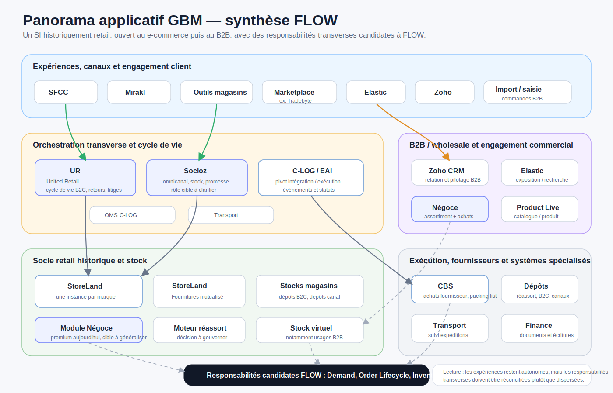

# Panorama applicatif GBM

## Intention

Cette page documente l'environnement applicatif des marques historiques du Groupe Beaumanoir.

Elle constitue le pendant du panorama BRD.

L'objectif n'est pas de recopier tous les flux applicatifs, mais d'identifier les zones, les systèmes pivots, les responsabilités portées par chaque composant et les questions structurantes pour FLOW.

## Point de départ du projet

À l'origine, le périmètre applicatif initial du programme FLOW était formulé de manière simple :

```text
GBM : remplacer StoreLand / Socloz
BRD : remplacer SAP / NewStore
```

Cette formulation reste utile pour comprendre le point de départ du programme.

Mais l'analyse du paysage GBM montre rapidement que ce cadrage est trop applicatif.

UR entre dans le champ d'étude de FLOW, non parce qu'il s'agit d'une application supplémentaire à remplacer mécaniquement, mais parce qu'il porte déjà une responsabilité transverse de cycle de vie commande B2C que StoreLand, fragmenté par marque, ne fournit pas naturellement.

Le scope GBM à investiguer devient donc :

```text
StoreLand
Socloz
UR
```

La question n'est donc pas seulement :

> Quelles applications faut-il remplacer ?

La question devient :

> Quelles responsabilités métier FLOW doit-il reprendre, généraliser, conserver, connecter ou laisser hors périmètre ?

## Insight de convergence : deux centres de gravité inverses

Un insight important du client permet de mieux comprendre la difficulté de convergence.

Le SI GBM est historiquement plutôt un SI retail, ouvert progressivement au e-commerce, puis étendu plus difficilement au B2B.

À l'inverse, le SI BRD semble plutôt issu d'un socle B2B / wholesale, ensuite adapté au retail.

```text
GBM
Retail d'abord
    ↓
E-commerce ajouté
    ↓
B2B intégré plus difficilement

BRD
B2B / wholesale d'abord
    ↓
Retail ajouté
    ↓
Omnicanal à recomposer
```

Cette différence ne relève pas seulement des applications. Elle décrit deux trajectoires SI presque inverses.

Pour FLOW, cela signifie que la convergence ne consiste pas à aligner deux SI équivalents. Elle consiste à créer une couche cible commune au-dessus de deux héritages différents :

- côté GBM, un SI retail multi-marques, multi-instances, ouvert ensuite à des canaux digitaux et B2B ;
- côté BRD, un SI historiquement orienté B2B / wholesale, adapté ensuite au retail, au stock magasin, à l'omnicanal et à la promesse.

FLOW doit donc unifier des responsabilités métier communes — demande, commande, stock, promesse, allocation, exception, exécution — sans présumer que GBM et BRD partent du même modèle historique.

## Insight de convergence : GBM n'est pas homogène en interne

La convergence ne concerne pas seulement BRD et GBM.

Elle concerne aussi les marques au sein de GBM.

```text
Convergence inter-groupes
    GBM ↔ BRD

Convergence intra-GBM
    marques premium ↔ autres marques
```

Le module Négoce de StoreLand rend cette convergence interne très visible : certaines marques disposent d'un processus outillé, tandis que d'autres opèrent encore par des moyens plus manuels ou dispersés.

FLOW doit donc éviter de considérer GBM comme un bloc homogène.

## Lecture générale

Le paysage GBM historique est plus fédéral que celui de BRD.

Il s'est construit autour des marques, des enseignes, des canaux et de leurs spécificités.

Cette organisation a permis de préserver des modes de fonctionnement différenciés.

Elle a aussi conduit à une multiplication des applications, des règles locales, des instances et des intégrations.

```text
GBM
    → logique historiquement fédérale par marque
    → StoreLand comme socle historique majeur
    → une instance StoreLand par marque
    → Socloz comme composant d'orchestration omnicanale / e-commerce
    → UR comme signal d'un besoin transverse
    → solutions spécialisées autour des canaux, du stock, de la logistique et du B2B
```

Le schéma suivant propose une synthèse FLOW du paysage GBM. Il ne représente pas une cible applicative validée : il sert à rendre visibles les zones, les composants pivots et les responsabilités transverses candidates à FLOW.

## Synthèse visuelle de l'écosystème GBM



## Canaux et flux observés

Le panorama GBM est structuré par canaux de vente.

Les zones visibles sont notamment :

| Zone | Composants visibles | Lecture FLOW |
| --- | --- | --- |
| E-commerce | SFCC, Mirakl | Canaux digitaux et marketplace côté client |
| Magasins | Outils magasins | Point de contact retail et opérations magasin |
| Marketplace | Intégrateur type Tradebyte | Intégration des flux marketplace |
| B2B / wholesale | Elastic, Zoho, import / saisie commandes B2B | Canal B2B / wholesale à clarifier |
| Orchestration / commandes | Socloz, UR, C-LOG / EAI, OMS C-LOG | Cycle de vie commande, intégration, orchestration et exécution |
| StoreLand | instances StoreLand, stocks magasins, dépôts, commandes B2B, moteur réassort | Socle historique retail et stock, avec plusieurs périmètres d'instance |
| Logistique | Transport, suivi expéditions, dépôts, moteur réassort | Exécution, suivi et décisions opérationnelles |

Les flux représentés distinguent plusieurs canaux :

- flux e-commerce ;
- flux marketplace ;
- flux magasins / retail ;
- flux wholesale.

Cette lecture montre un SI très orienté flux et canaux. La difficulté n'est pas seulement de relier des systèmes, mais de comprendre où sont portées les décisions, les statuts, la disponibilité de stock et les responsabilités de cycle de vie.

## StoreLand

StoreLand est le socle historique majeur des marques GBM.

STLD désigne StoreLand.

Le paysage repose sur plusieurs instances StoreLand, généralement organisées par marque.

Il existe également un StoreLand Fournitures mutualisé, utilisé pour les fournitures transverses magasins comme les stylos, le petit mobilier ou d'autres besoins non rattachés à une seule marque.

```text
StoreLand
    → une instance par marque
    → responsabilités retail, commandes, stocks et opérations associées

StoreLand Fournitures
    → instance mutualisée multimarques
    → fournitures, petits équipements, besoins transverses magasins
```

Cette architecture multi-instances explique une partie de la complexité GBM.

Le problème n'est pas seulement qu'il existe plusieurs applications. Le même socle StoreLand est décliné selon des périmètres différents, ce qui fragmente naturellement la vision transverse des commandes, des stocks, des cycles de vie et des exceptions.

FLOW devra donc traiter StoreLand non comme une seule application homogène, mais comme un ensemble d'instances portant des responsabilités proches, avec des périmètres marque ou multimarques différents.

Cette distinction est structurante pour le remplacement, la reprise des flux et la trajectoire de migration.

### Module Négoce StoreLand

Le module Négoce de StoreLand n'est activé que pour les marques premium, notamment parce qu'il est coûteux.

Pour les autres marques, certaines commandes sont passées de manière plus manuelle ou dispersée : mail, Excel, imports depuis d'autres référentiels ou autres mécanismes opérationnels.

Le module Négoce permet d'adresser deux familles de fonctionnalités :

- entrer un client, construire un assortiment et préparer un commercial agreement ;
- passer des commandes d'achat.

Ces deux familles de fonctionnalités ne relèvent pas nécessairement du même domaine cible.

Le processus de négociation, d'assortiment et de fabrication du catalogue relève plutôt du monde de l'engagement.

La commande d'achat peut entrer dans le champ FLOW si elle participe à l'exécution de la demande, à l'approvisionnement, à la promesse ou à la disponibilité future.

```text
Engagement / Commercial Design
    → client
    → assortiment
    → commercial agreement
    → catalogue
    → prix / conditions

FLOW
    → commande d'achat
    → engagement d'approvisionnement
    → suivi d'exécution
    → événements
    → disponibilité future
```

L'idée cible est d'avoir un module ou une capacité Négoce pour tout le monde, sans forcément reconduire le même découpage applicatif que le module Négoce StoreLand actuel.

## UR — United Retail

UR signifie United Retail.

UR est un composant développé sur mesure en .NET / C#.

Il regroupe toutes les commandes B2C afin de donner une vision globale du cycle de vie commande, dans un contexte où il existe une instance StoreLand par marque.

UR n'est donc pas simplement un référentiel ou un composant technique. C'est un composant métier transverse, construit pour compenser la fragmentation des instances StoreLand.

```text
StoreLand par marque
        ↓
fragmentation des commandes / cycles de vie / stocks
        ↓
UR
        ↓
consolidation transverse B2C
```

Les responsabilités connues d'UR sont notamment :

- centraliser le cycle de vie des commandes B2C ;
- envoyer et recevoir les mises à jour des commandes ;
- gérer les retours ;
- gérer les remboursements ;
- gérer les statuts des commandes retournées pour les sites e-commerce ;
- réintégrer les articles en stock ;
- gérer les mouvements de points fidélité ;
- gérer certains litiges Service Client sur commandes magasins, notamment mauvais article ou article manquant ;
- permettre, selon les cas, de passer une nouvelle commande et de rembourser la cliente.

UR est très intéressant pour FLOW, car il ressemble déjà à un embryon d'orchestration transverse du cycle de vie commande.

Il porte à la fois :

- des statuts ;
- des transitions ;
- des mises à jour inter-systèmes ;
- des retours ;
- des remboursements ;
- des litiges ;
- des réintégrations stock ;
- des exceptions Service Client.

UR n'est donc pas seulement une application à remplacer. C'est une trace architecturale d'un manque de transversalité dans le SI existant.

### Recommandation d'architecture — UR et FLOW

UR doit entrer dans le champ d'étude de FLOW.

La raison n'est pas technique, mais métier : UR porte une responsabilité transverse de cycle de vie commande B2C, d'exception, de retour, de remboursement et de réintégration stock.

FLOW devra décider s'il reprend ces responsabilités, les généralise, ou conserve UR comme composant transitoire pendant la trajectoire de migration.

Dans une cible FLOW, les responsabilités aujourd'hui portées par UR semblent candidates à une capacité plus générale de type :

```text
Demand / Order Lifecycle Orchestration
    → cycle de vie commande
    → exceptions
    → retours
    → remboursements
    → litiges
    → réintégration stock
    → consolidation transverse multi-marques
```

## Socloz

Socloz apparaît comme un composant structurant autour de l'e-commerce, de l'omnicanal, des stocks et des commandes.

Son rôle précis devra être clarifié : OMS, orchestration omnicanale, promesse, stock disponible, réservation, ou combinaison de ces responsabilités.

Le point important pour FLOW est que Socloz ne doit pas être analysé seulement comme une application à remplacer.

Il faut identifier les responsabilités qu'il porte réellement aujourd'hui :

- orchestration des flux e-commerce ;
- articulation avec les magasins ;
- relation avec UR ;
- relation avec C-LOG / EAI ;
- contribution à la vision stock ;
- contribution à la promesse ou à la réservation.

## C-LOG / EAI et OMS C-LOG

C-LOG / EAI apparaît comme un pivot d'intégration logistique.

Il se situe au croisement des flux e-commerce, magasins, marketplace et wholesale.

OMS C-LOG et Transport apparaissent à proximité, ce qui suggère une articulation entre orchestration, intégration, exécution et suivi.

Pour FLOW, la question est de distinguer :

- ce qui relève de l'intégration technique ;
- ce qui relève de la logique métier ;
- ce qui relève de l'exécution logistique ;
- ce qui relève du suivi d'événements et de statuts.

Cette distinction est importante pour éviter de remplacer un composant d'intégration par une plateforme métier, ou inversement de laisser dans un EAI des responsabilités de décision et d'orchestration qui devraient être explicites.

## B2B / wholesale : Elastic, Zoho et commandes B2B

La zone B2B / wholesale fait apparaître notamment Elastic, Zoho et des mécanismes d'import ou de saisie de commandes B2B.

Zoho est associé à une notion de stock virtuel.

Cette zone est particulièrement intéressante au regard de l'insight client : GBM est d'abord un SI retail, ensuite ouvert au e-commerce, puis plus difficilement au B2B.

Le B2B semble donc moins naturellement intégré au socle historique GBM que le retail.

Pour FLOW, cela pose plusieurs questions :

- le B2B doit-il être traité comme un canal spécifique ou comme une variation d'un même objet demande / commande ?
- le stock virtuel Zoho doit-il être conservé, remplacé ou projeté dans une capacité d'Inventory Visibility ?
- les commandes B2B doivent-elles rejoindre le même cycle de vie transverse que le B2C ?
- les règles de promesse, allocation, stock et réassort sont-elles communes ou spécifiques au wholesale ?

## Stock, disponibilité et réassort

Le panorama GBM fait apparaître plusieurs lieux de stock ou de décision stock :

- stocks magasins ;
- dépôts B2C ;
- dépôt réassort ;
- dépôts dédiés par canal de distribution ;
- stock virtuel ;
- moteur réassort ;
- flux de stock entre Socloz, StoreLand, C-LOG / EAI et les systèmes de canal.

Le moteur réassort est un signal important.

Il indique qu'une partie des décisions d'approvisionnement ou de redistribution est déjà externalisée dans un composant dédié.

Pour FLOW, il faudra distinguer :

- la visibilité de stock ;
- la décision de réassort ;
- l'allocation ;
- la réservation ;
- la promesse ;
- l'exécution logistique.

Ces responsabilités peuvent être connectées, mais elles ne doivent pas être confondues.

## Applications et composants mentionnés

Les composants mentionnés dans le panorama GBM sont notamment :

- StoreLand ;
- StoreLand Fournitures ;
- module Négoce StoreLand ;
- UR / United Retail ;
- Socloz ;
- C-LOG / EAI ;
- OMS C-LOG ;
- Transport ;
- SFCC ;
- Mirakl ;
- intégrateur marketplace, par exemple Tradebyte ;
- Elastic ;
- Zoho ;
- import / saisie commandes B2B ;
- outils magasins ;
- moteur réassort ;
- dépôts B2C ;
- stocks magasins ;
- suivi expéditions.

Ces composants ne doivent pas être lus comme une cible FLOW.

Ils représentent le paysage de départ, avec ses spécialisations, ses héritages, ses frontières applicatives et ses responsabilités parfois implicites.

## Lecture FLOW

Dans une lecture FLOW, GBM met en évidence le risque inverse de BRD.

BRD montre les limites d'un socle historiquement plus B2B / wholesale lorsqu'il est adapté au retail, à l'omnicanal et à la promesse.

GBM montre les limites d'un socle historiquement retail lorsqu'il est ouvert au e-commerce puis au B2B.

FLOW doit donc préserver l'autonomie utile de GBM, sans reproduire les silos applicatifs ou les fragments d'instances.

La comparaison doit se faire par responsabilités, et non seulement par applications :

| Responsabilité | Composants GBM à investiguer | Lecture FLOW |
| --- | --- | --- |
| Cycle de vie commande B2C | UR, StoreLand, Socloz | Responsabilité transverse candidate FLOW |
| Orchestration omnicanale | Socloz, C-LOG / EAI, UR | Clarifier orchestration, intégration et exécution |
| Stock disponible | StoreLand, Socloz, Zoho, C-LOG / EAI | Construire une capacité d'Inventory Visibility fiable |
| Retours / remboursements / litiges | UR, StoreLand, Service Client | Candidat Case / exception management |
| Négoce / B2B | StoreLand Négoce, Zoho, Elastic, commandes manuelles | Découpler engagement commercial et commande d'achat |
| Réassort | Moteur réassort, StoreLand, stocks magasins | Décision à expliciter et gouverner |
| B2B / wholesale | Elastic, Zoho, commandes B2B | Canal à intégrer sans le plaquer sur le modèle retail |
| Exécution logistique | C-LOG / EAI, OMS C-LOG, Transport, suivi expéditions | Exécution et événements à connecter à FLOW |

## Responsabilités à investiguer

Plusieurs responsabilités devront être clarifiées dans les prochains travaux :

- cycle de vie des demandes et commandes ;
- rôle précis de StoreLand par instance ;
- rôle précis de StoreLand Fournitures ;
- rôle précis du module Négoce StoreLand ;
- rôle précis de UR / United Retail ;
- rôle précis de Socloz ;
- gestion des stocks et disponibilités ;
- allocation et promesse ;
- orchestration omnicanale ;
- articulation magasin / e-commerce / marketplace / B2B / logistique ;
- retours, remboursements et litiges ;
- données produit, article, saison et assortiment ;
- interfaces avec Finance et systèmes d'exécution.

## Questions structurantes pour FLOW

Le panorama GBM conduit à plusieurs questions :

- Quelles responsabilités StoreLand porte-t-il aujourd'hui qui devraient être reprises par FLOW ?
- Quelles différences existent entre les instances StoreLand par marque ?
- Quel rôle spécifique porte StoreLand Fournitures dans le paysage multi-marques ?
- Le module Négoce StoreLand doit-il être généralisé, remplacé, ou découpé en capacités cibles distinctes ?
- La commande d'achat B2B / Négoce doit-elle être une capacité FLOW ?
- La négociation, l'assortiment et le catalogue doivent-ils rester dans le domaine engagement ?
- UR doit-il être remplacé, absorbé progressivement par FLOW, ou conservé comme composant transitoire ?
- Les responsabilités d'UR relèvent-elles d'une capacité cible de Case / Order Lifecycle Orchestration ?
- Socloz porte-t-il une responsabilité d'OMS, de promesse, de réservation, d'orchestration omnicanale ou seulement d'intégration e-commerce ?
- C-LOG / EAI porte-t-il uniquement de l'intégration technique ou aussi de la logique métier ?
- Où se trouve aujourd'hui la vision fiable du stock disponible par canal ?
- Le moteur réassort est-il une capacité décisionnelle à conserver hors FLOW, à connecter ou à intégrer ?
- Comment intégrer le B2B dans FLOW sans forcer le modèle retail historique de GBM ?
- Quels systèmes doivent être remplacés, conservés, encapsulés ou connectés ?

## À retenir

GBM ne doit pas être lu comme un simple paysage applicatif à rationaliser.

GBM montre pourquoi la fédération est nécessaire : certaines spécificités doivent rester locales, mais certaines responsabilités dépassent naturellement les frontières des marques, des instances et des applications.

L'insight central est que GBM est historiquement un SI retail, ouvert ensuite au e-commerce, puis plus difficilement au B2B. Cette trajectoire explique une partie des composants transverses apparus autour de StoreLand, notamment UR.

UR signifie United Retail. Il est dans le scope de FLOW non par sa technologie, mais par sa responsabilité métier : il porte déjà une forme de cycle de vie transverse des commandes B2C, avec retours, remboursements, litiges et réintégration stock.

Le module Négoce montre que la convergence est aussi intra-GBM : les marques premium disposent d'un processus outillé, tandis que d'autres marques opèrent encore certains flux de manière plus manuelle ou dispersée.

FLOW doit donc permettre de mutualiser les capacités transverses sans uniformiser les modes de fonctionnement utiles.
