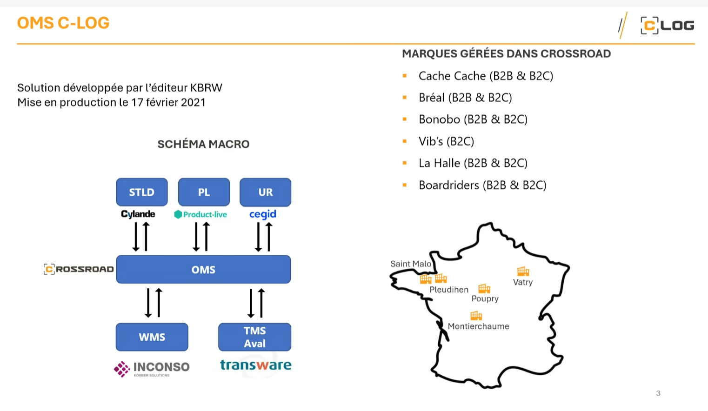
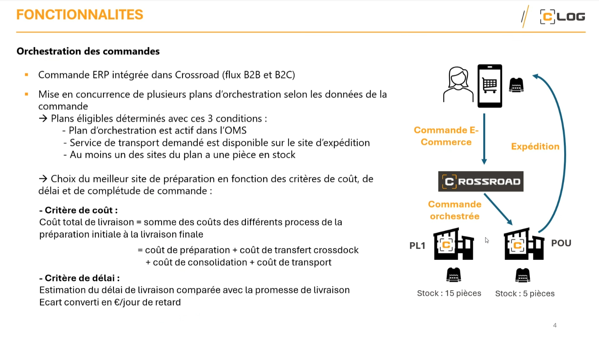
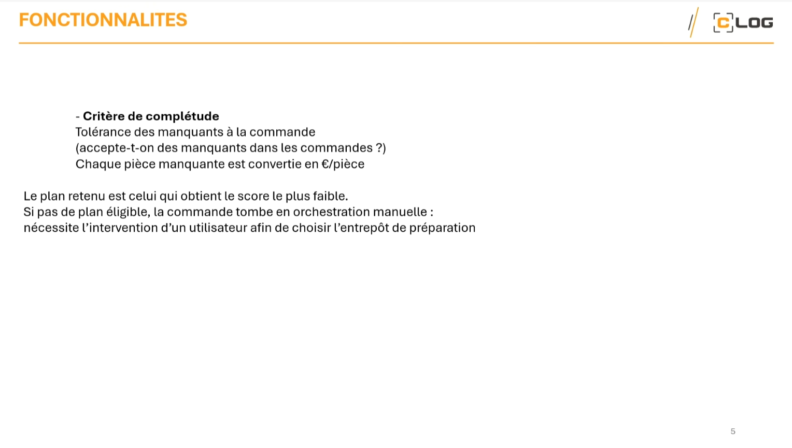
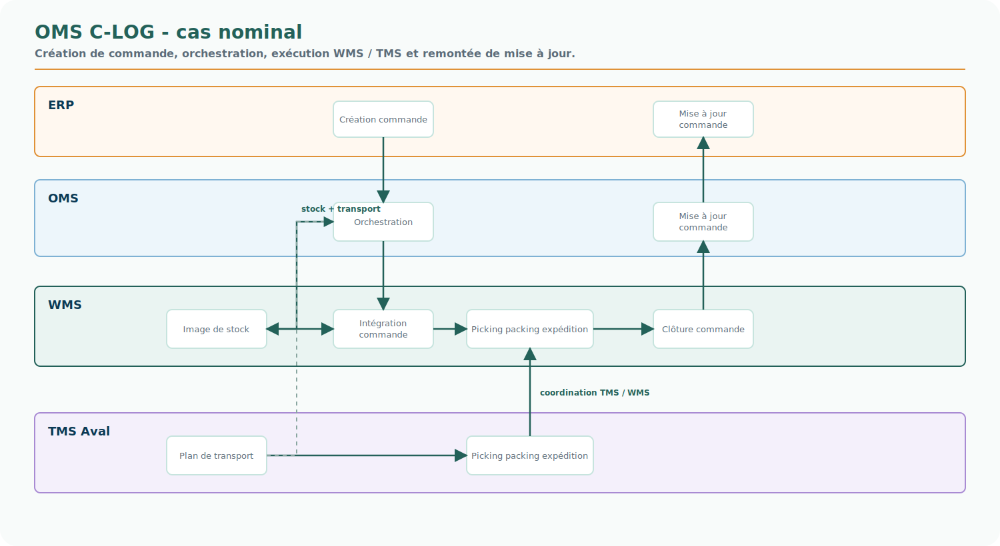
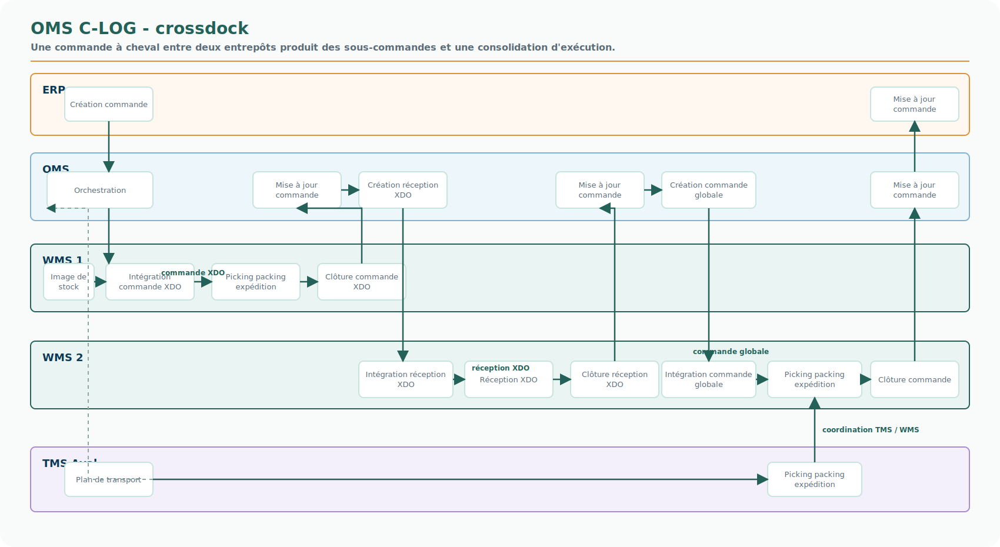
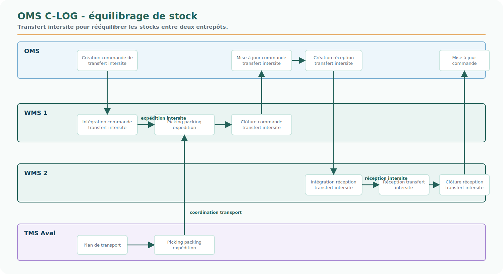

# OMS C-LOG - atelier du 30 juin 2026

<!-- FLOW-READING-CARD:START -->
<div class="flow-reading-card">
  <div class="flow-reading-card__title">Repère de lecture</div>
  <div class="flow-reading-card__grid">
    <div>
      <span>Public cible</span>
      <strong>Architecte, Métier, Contributeur</strong>
    </div>
    <div>
      <span>Temps de lecture</span>
      <strong>10 min</strong>
    </div>
    <div>
      <span>Usage</span>
      <strong>Comprendre le point de départ et les tensions observées</strong>
    </div>
  </div>
</div>
<!-- FLOW-READING-CARD:END -->

## Intention

Cette page documente les éléments partagés pendant l'atelier C-LOG du 30 juin 2026 consacré à l'OMS C-LOG.

Elle ne décrit pas une cible FLOW validée.

Elle conserve les faits observés, les schémas d'atelier et les points d'architecture utiles pour comprendre le rôle réel de l'OMS C-LOG dans le paysage GBM.

L'enjeu pour FLOW est important : C-LOG n'est pas seulement un exécutant logistique. L'OMS C-LOG porte déjà des décisions de fulfillment, des règles d'orchestration, des arbitrages de coût / délai / complétude et des interactions avec WMS, TMS, ERP et canaux.

## Source de l'atelier

| Élément | Information |
| --- | --- |
| Date | 30 juin 2026 |
| Sujet | OMS C-LOG |
| Projet | Projet démarré en 2019 |
| Chef de projet | Philippe LEGUEGE |
| PMO | Francis Sailly |
| Éditeur | KBRW |
| Produit logiciel | Crossroad |
| Solution C-LOG | OMS C-LOG développé par KBRW sur la base de Crossroad |
| Mise en production indiquée dans le support | 17 février 2021 |
| Modèle économique mentionné | C-LOG paie des licences d'infrastructure et d'usage |

Le support d'atelier indique que Crossroad gère notamment Cache Cache, Bréal, Bonobo, Vib's, La Halle et Boardriders, sur des périmètres B2B et / ou B2C selon les marques.

## Schéma macro présenté



Point d'attention issu de l'atelier : le premier schéma ne doit pas être lu comme une cible à jour sur Product-Live. L'OMS ne dialogue plus avec Product-Live.

Les briques visibles ou mentionnées sont :

- StoreLand ;
- UR / Cegid ;
- OMS Crossroad ;
- WMS Inconso ;
- TMS Aval Transware ;
- EAI C-LOG ;
- SAP pour le cas Boardriders ;
- Product-Live dans le support historique, mais à ne plus retenir comme dialogue actif.

L'EAI utilisé pour les échanges repose sur Dollar Universe (`$U`), ordonnanceur de batch, et Talend. Il s'agit de la même plateforme technologique que Beaumanoir, mais avec une instance dédiée C-LOG.

## Activités couvertes par C-LOG

C-LOG opère plusieurs types de flux :

- entrepôt vers entrepôt, quelles que soient les marques ;
- entrepôt vers magasin ;
- entrepôt vers client final.

Le site de Poupry est plutôt associé à l'activité e-commerce.

Le volume mentionné pendant l'atelier donne un ordre de grandeur : environ 20 000 commandes sur les dernières 24 heures.

## Positionnement de l'OMS dans la décision d'entrepôt

Le comportement n'est pas identique selon les marques et les sources de commande.

Pour Boardriders, l'ERP SAP décide de l'entrepôt. L'OMS applique alors une logique spécifique de type :

```text
if (BRD) {
    prendre le site porté par l'order
}
```

L'équipe C-LOG appelle cela une orchestration passive.

Pour les autres marques, si la commande porte un entrepôt, cette information n'est pas forcément prise en compte : l'OMS décide de l'entrepôt selon ses règles propres.

Cette différence est structurante pour FLOW. Elle montre qu'une même brique OMS peut être tantôt décisionnaire, tantôt exécutante d'une décision portée par un autre système.

## Principes d'orchestration des commandes



L'OMS met en concurrence plusieurs plans d'orchestration selon les données de la commande.

Un plan est éligible si :

- le plan d'orchestration est actif dans l'OMS ;
- le service de transport demandé est disponible sur le site d'expédition ;
- au moins un des sites du plan dispose d'une pièce en stock.

Le choix du meilleur site de préparation repose sur plusieurs critères :

- coût ;
- délai ;
- complétude de commande.

Ces critères sont paramétrables selon les règles retenues et la gouvernance de l'offre de service.

Le coût total de livraison est compris comme la somme des coûts nécessaires depuis la préparation initiale jusqu'à la livraison finale :

```text
coût de préparation
+ coût de transfert crossdock
+ coût de consolidation
+ coût de transport
```

Le délai de livraison est comparé à la promesse de livraison. L'écart peut être converti en pénalité exprimée en euros par jour de retard.

## Complétude, score et file manuelle



La complétude de commande entre aussi dans le calcul.

L'OMS peut convertir chaque pièce manquante en coût de pénalisation exprimé en euros par pièce.

Le plan retenu est celui qui obtient le score le plus faible.

Le scoring est paramétrable : les critères, pondérations ou pénalisations peuvent évoluer selon les choix de pilotage retenus.

S'il n'existe pas de plan éligible, la commande tombe en orchestration manuelle : un utilisateur doit choisir l'entrepôt de préparation ou relancer le traitement lorsque les conditions le permettent.

Dans l'atelier, cette logique a aussi été décrite comme une agilité d'exécution du plan : si une commande n'est pas assurée, elle finit par entrer dans une file manuelle afin d'être traitée manuellement ou relancée automatiquement.

## Transporteurs et comportements par flux

Les règles de transport ne sont pas uniformes.

Pour les commandes B2C qui arrivent depuis UR, le transporteur est imposé par la commande.

Pour les commandes vers entrepôt ou magasin, un transporteur par défaut est paramétré.

Pour Bonobo, Cache Cache et Bréal, le calcul n'est pas identique : le transporteur est calculé comme dans le réassort.

Pour La Halle, le plan est différent, car il prévoit une logique proche d'une tournée.

Pour les livraisons en France, le coût transporteur est aujourd'hui considéré comme identique selon l'accord transporteur ; l'OMS n'optimise donc pas le choix par rapport à l'adresse de destination.

## Crossdock, split et sous-commandes

Le crossdock permet de traiter une commande à cheval entre deux entrepôts.

L'objectif est de réaliser un transfert afin d'obtenir une seule expédition.

Les marques peuvent choisir ces comportements dans une offre de service en cours de consolidation, mais elles ne choisissent pas directement seules : la décision passe par une gouvernance et une décision groupe Beaumanoir.

L'OMS autorise aussi le split de commande.

Dans le cas du crossdock, la commande maître produit des sous-commandes pour piloter plusieurs WMS.

Cette observation est importante : `WMS 1` et `WMS 2` dans les schémas de processus ne représentent pas deux serveurs ou deux outils différents. Ils représentent deux entrepôts.

## Processus d'intégration observés

Les trois schémas suivants sont des reproductions SVG propres des supports d'atelier. Ils gardent la logique de swimlanes ERP / OMS / WMS / TMS Aval, tout en rendant les échanges plus lisibles dans le site.

### Cas nominal



Dans le cas nominal, l'ERP crée la commande, l'OMS orchestre, le WMS intègre et exécute, puis les mises à jour remontent vers l'OMS et l'ERP.

Le TMS Aval intervient sur le plan de transport et le picking / packing / expédition.

### Crossdock



Le scénario crossdock montre la création de réceptions XDO, la création d'une commande globale et la coordination entre deux entrepôts.

Ce flux illustre bien la différence entre commande maître, sous-commandes et mouvements d'exécution.

### Équilibrage de stock



L'équilibrage de stock repose sur des commandes de transfert intersite, des réceptions intersite et des clôtures associées.

L'atelier mentionne également un usage de Dataiku pour calculer les volumes à rééquilibrer.

## Stock, disponibilité et ship from store

Les informations de disponibilité magasin sont présentes dans le TMS.

Dans ce contexte, la disponibilité magasin ne désigne pas seulement un stock. Elle combine :

- le stock magasin réel ;
- la capacité du magasin ;
- les contraintes opérationnelles, par exemple horaires d'ouverture, indisponibilité pour inventaire ou restriction temporaire.

C-LOG pourrait donc théoriquement faire du ship from store à condition de récupérer les stocks magasins.

La réserve exprimée pendant l'atelier porte sur la capacité de l'application à traiter ces informations en volume.

L'exemple Caroll est instructif : avant son intégration au groupe, Caroll disposait d'une fonctionnalité ship from store. Cette fonctionnalité a été supprimée lors de l'intégration, puis réintégrée avec Socloz après une perte de chiffre d'affaires.

Pour les stocks e-commerce et marketplace, des fichiers sont échangés entre plateformes.

Les cadences et traitements mentionnés sont :

- envoi tous les soirs de l'état des stocks à StoreLand pour contrôler les écarts ;
- batch de stock optimal, destiné à éviter pénurie et surstock pour un magasin ou un entrepôt ;
- remplacement de SCORETEX, vieillissant, par IRMA, nouveau produit développé sur mesure pour calculer ces stocks optimum ;
- usage de Dataiku pour calculer les volumes à rééquilibrer.

## Lecture FLOW

L'atelier confirme que l'OMS C-LOG est une capacité de fulfillment déjà active dans le SI.

Il ne faut pas le réduire à une brique d'intégration ou à un simple routeur de commandes.

Il porte :

- une décision d'entrepôt ;
- des plans d'orchestration ;
- des critères de coût, délai et complétude ;
- des pénalités transformées en score économique ;
- des comportements de crossdock, split, sous-commandes et file manuelle ;
- des interactions fortes avec WMS, TMS, ERP, UR et StoreLand ;
- une logique d'offre de service logistique à gouverner au niveau groupe.

Cette situation conforte plusieurs concepts FLOW :

| Concept FLOW | Lecture issue de l'atelier |
| --- | --- |
| Demand / Fulfillment / Supply | La demande arrive depuis UR, ERP ou StoreLand ; le fulfillment arbitre le plan ; Supply exécute via WMS, TMS et entrepôts. |
| Case Management | Une commande qui tombe en file manuelle ou doit être relancée automatiquement ressemble à un Case d'exception, avec historique, décisions et actions. |
| Stock Unifié | Le ship from store et les flux e-commerce / marketplace montrent que la disponibilité ne peut pas être traitée uniquement comme un stock entrepôt C-LOG : elle doit intégrer stock réel, capacité et contraintes magasin. |
| Fulfillment Network Configuration | Les entrepôts, capacités, plans actifs, services transport, crossdock et tournées relèvent d'une configuration de réseau d'exécution. |
| Supply Service Registry | Les services WMS, TMS, transporteurs, SLA, disponibilités et conditions d'appel doivent être décrits comme services mobilisables, pas seulement comme interfaces techniques. |
| Décision métier explicite | Le score coût / délai / complétude est une décision métier paramétrable, explicable et gouvernable. |
| Données en transit gouvernées | Les fichiers stock, batchs, SCORETEX / IRMA, Dataiku, EAI et mises à jour ERP montrent un fort besoin de contrats de données, fraîcheur, supervision et réconciliation. |

## Arbitrage de positionnement de l'OMS

L'atelier fait émerger un arbitrage majeur : où doit être positionnée la responsabilité OMS dans l'entreprise, et qui détient la promesse client omnicanale ?

Ce n'est pas seulement une question d'application.

C'est une décision de gouvernance entre filiale logistique, plateforme FLOW et domaines d'engagement.

| Hypothèse | Description | Ce que cela implique | Risque principal |
| --- | --- | --- | --- |
| 1. OMS C-LOG étendu | L'OMS C-LOG prend complètement en charge les magasins et gère l'omnicanalité. | La promesse client et une partie majeure du fulfillment omnicanal sont détenues par C-LOG. FLOW consomme ou encadre un service C-LOG devenu très structurant. | La promesse client devient portée par une filiale Supply ; risque de décalage avec la gouvernance Demand / Engagement groupe. |
| 2. OMS remonté au niveau FLOW | Comme pour BRD, l'OMS C-LOG ne décide pas la source et le transport ; la décision d'orchestration est remontée au niveau FLOW. | FLOW porte la décision de source, transport, promesse et arbitrage omnicanal. C-LOG devient un service Supply exécutant ou un moteur spécialisé appelé par FLOW. | Nécessite de reprendre ou réimplémenter des règles déjà portées par Crossroad, avec un contrat précis entre FLOW et C-LOG. |
| 3. OMS complémentaire hors C-LOG | C-LOG reste autonome sur son périmètre, et un autre OMS est construit pour les usages non couverts. | On évite de déplacer brutalement le périmètre C-LOG, mais on ajoute un deuxième centre d'orchestration. | Intégration probablement complexe : double décision, cohérence de promesse fragile, règles dupliquées, responsabilité difficile à expliquer. |

La question structurante devient donc :

> Où place-t-on la décision de promesse omnicanale : dans C-LOG, dans FLOW, ou dans une orchestration distribuée à gouverner explicitement ?

À ce stade, l'hypothèse 3 paraît la plus risquée architecturalement, car elle ajoute un centre de décision sans résoudre naturellement la cohérence de promesse.

L'hypothèse 1 peut être pertinente si le groupe accepte que C-LOG porte une promesse client très large, au-delà de l'exécution Supply.

L'hypothèse 2 est la plus alignée avec la vision FLOW, mais elle impose d'instruire finement ce que Crossroad sait déjà faire, ce que FLOW doit reprendre, et ce qui doit rester dans C-LOG comme capacité Supply spécialisée.

## Questions ouvertes pour FLOW

- Quel système doit être autorité de décision pour l'entrepôt : FLOW, OMS C-LOG, ERP, UR ou la commande source ?
- Qui détient la promesse client omnicanale : C-LOG, FLOW, Engagement, ou une gouvernance partagée ?
- Comment représenter proprement l'orchestration passive observée pour Boardriders ?
- La logique de score coût / délai / complétude doit-elle rester dans C-LOG ou devenir un Decision Service gouverné par FLOW ?
- Où faut-il modéliser l'offre de service logistique : Fulfillment Network Configuration, Supply Service Registry ou gouvernance Supply séparée ?
- Quel rôle cible donner à l'OMS C-LOG si FLOW reprend une partie du fulfillment : service conservé, service encapsulé, composant à remplacer ou moteur d'exécution spécialisé ?
- C-LOG peut-il absorber le ship from store à l'échelle groupe si les stocks magasins sont intégrés ?
- Quelle source ou projection doit assembler la disponibilité magasin complète : stock réel, capacité et contraintes ?
- Comment articuler IRMA, Dataiku et le Stock Unifié cible autour du stock optimal et du rééquilibrage ?
- Comment tracer les décisions et sous-commandes afin d'expliquer une promesse, un crossdock ou une expédition partielle ?
- Quels événements C-LOG doit-il publier pour que FLOW, les Vues 360 et le service client puissent comprendre l'état réel d'une demande ?

## Liens avec les autres pages

- [Panorama applicatif GBM](panorama-gbm.md)
- [FLOW dans l'écosystème GBM](../architecture-cible/flow-dans-ecosysteme-gbm.md)
- [C-LOG : une décision de fulfillment déjà distribuée](../hotspots/c-log-decision-fulfillment.md)
- [Stock Unifié](../architecture-cible/produits/stock-unifie.md)
- [Fulfillment Network Configuration](../architecture-cible/produits/fulfillment-network-configuration.md)
- [Supply Service Registry](../architecture-cible/produits/supply-service-registry.md)
- [Principe 4 - Articuler Engagement, Demand, Fulfillment et Supply](../principes-directeurs/4-separer-demand-et-supply.md)
