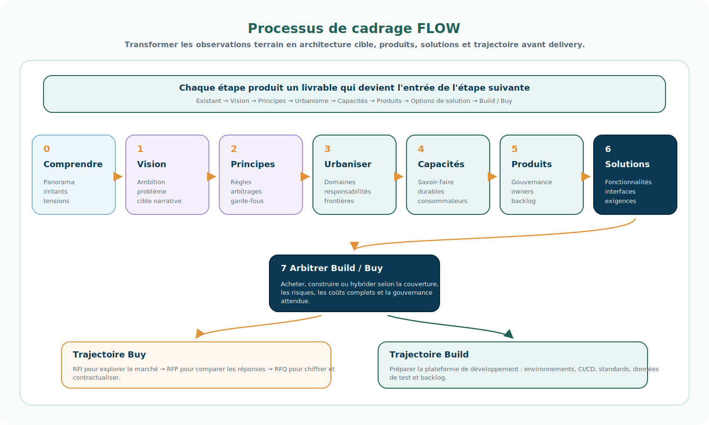

# Processus de cadrage

## Introduction

Le programme FLOW ne part pas des produits du marché.

Il ne part pas non plus des fonctionnalités.

La conception commence par la compréhension de l'entreprise, de ses contraintes et de ses modèles opérationnels.

La méthodologie projet fait émerger progressivement les capacités à mutualiser à partir des réalités observées sur le terrain.

L'enjeu est de conserver une chaîne logique claire : chaque phase produit un livrable qui devient l'entrée de la phase suivante.

## Périmètre de cet article

Cet article décrit la méthodologie de cadrage et de conception amont du programme FLOW.

Il couvre le passage des observations terrain aux choix d'urbanisme, de capacités, de produits et de solutions candidates.

Il ne décrit pas encore la méthodologie de delivery.

La méthode de delivery — organisation des équipes, incréments, backlog de réalisation, pilotage de build, tests, déploiement, run et adoption opérationnelle — fera l'objet d'un article dédié plus tard.

```text
Cet article
    → cadrage
    → compréhension
    → vision
    → principes
    → urbanisme
    → capacités
    → produits candidats
    → solutions candidates

Article futur
    → delivery
    → construction
    → tests
    → déploiement
    → run
    → adoption
```

```text
Existant
    ↓
Vision
    ↓
Principes
    ↓
Domaines / responsabilités
    ↓
Capacités
    ↓
Produits
    ↓
Fonctionnalités / solutions candidates
```

## Vue d'ensemble



Cette vue doit être lue comme une chaîne de cadrage et de conception.

On ne passe pas directement d'un irritant terrain à une solution.

On transforme progressivement les observations en choix d'architecture, puis en produits gouvernables, puis en fonctionnalités consommables.

---

## Étape 0 — Comprendre l'existant

Question :

> Que nous apprend réellement l'entreprise ?

### Objectif

Cette étape sert à construire une compréhension partagée de la situation réelle.

Il ne s'agit pas encore de concevoir la cible.

Il s'agit de qualifier les faits, les irritants, les écarts entre les organisations, les applications existantes, les responsabilités implicites et les zones de tension.

### Activités

- conduire des interviews ;
- animer des ateliers de découverte ;
- analyser les processus existants ;
- analyser les applications et leurs responsabilités réelles ;
- cartographier les flux et les dépendances majeures ;
- identifier les irritants opérationnels ;
- repérer les divergences entre BRD, GBM et les marques ;
- distinguer les faits établis, les hypothèses et les sujets ouverts.

### Livrables attendus

- panorama applicatif et métier ;
- liste des constats qualifiés ;
- irritants et tensions structurantes ;
- questions ouvertes ;
- premiers insights ;
- éléments de contexte réutilisables dans la suite du programme.

### Critère de sortie

L'étape est suffisamment mûre lorsque l'équipe sait formuler les problèmes réels à résoudre sans les réduire prématurément à une solution ou à une application à remplacer.

### Ce que cette étape apporte à la suivante

Elle fournit la matière brute de la vision : les faits, tensions et insights qui justifient l'ambition cible.

---

## Étape 1 — Construire une vision

Question :

> Quelle est l'ambition commune ?

### Objectif

Cette étape transforme les constats en ambition partagée.

La vision ne doit pas être une liste de fonctionnalités.

Elle doit expliquer pourquoi FLOW existe, quel problème d'entreprise il adresse, et quel changement de modèle il porte.

### Activités

- reformuler les problèmes structurants issus de l'existant ;
- expliciter l'ambition de convergence ;
- distinguer ce qui relève de la plateforme FLOW et ce qui reste autour ;
- définir le récit cible : pourquoi FLOW, pour qui, et à quelle échelle ;
- identifier les promesses de valeur : cohérence, transversalité, réduction des doubles saisies, pilotage de la demande, stock unifié, capacité de décision métier.

### Livrables attendus

- vision cible ;
- problème d'entreprise reformulé ;
- promesse de valeur ;
- périmètre d'intention ;
- premières hypothèses de positionnement de FLOW dans le SI.

### Critère de sortie

L'étape est suffisamment mûre lorsque les parties prenantes peuvent expliquer, avec les mêmes mots, ce que FLOW cherche à devenir et ce qu'il ne cherche pas à devenir.

### Ce que cette étape apporte à la suivante

Elle fournit le cap.

Les principes directeurs peuvent alors être définis comme les règles de conception nécessaires pour protéger cette vision dans les arbitrages futurs.

---

## Étape 2 — Définir les principes directeurs

Question :

> Comment souhaitons-nous concevoir la plateforme ?

### Objectif

Cette étape transforme la vision en règles de conception.

Les principes directeurs servent à éviter que chaque arbitrage soit rejoué de zéro.

Ils formalisent les convictions d'architecture qui guident FLOW : fédérer plutôt qu'uniformiser, séparer Demand et Supply, faire émerger le processus des décisions, qualifier les informations plutôt que parler indistinctement de Master Data, etc.

### Activités

- identifier les arbitrages récurrents du programme ;
- formuler les convictions d'architecture ;
- expliciter les conséquences pratiques de chaque principe ;
- vérifier que les principes sont utilisables pour arbitrer ;
- relier les principes à des exemples concrets issus de BRD et GBM.

### Livrables attendus

- principes directeurs ;
- implications concrètes ;
- exemples d'application ;
- points de vigilance ;
- critères d'arbitrage.

### Critère de sortie

L'étape est suffisamment mûre lorsque les principes permettent de trancher ou cadrer une discussion d'architecture sans revenir systématiquement aux préférences individuelles.

### Ce que cette étape apporte à la suivante

Elle fournit les garde-fous de l'urbanisation.

La cartographie cible peut alors être construite selon des critères explicites, et non seulement selon l'existant applicatif.

---

## Étape 3 — Urbaniser

Question :

> Quelles sont les missions durables de l'entreprise ?

### Objectif

Cette étape transforme la vision et les principes en structure d'urbanisme.

Elle ne consiste pas à déplacer les applications existantes dans des cases.

Elle consiste à identifier les domaines, responsabilités et frontières durables qui doivent rester compréhensibles au-delà des solutions actuelles.

La chaîne de lecture privilégiée est :

```text
Domaine
    ↓
Responsabilité
```

### Activités

- identifier les grands domaines fonctionnels ;
- clarifier les responsabilités durables ;
- distinguer Engagement, Demand, Supply et Finance ;
- positionner les applications existantes par responsabilité réelle ;
- repérer les responsabilités dispersées entre plusieurs systèmes ;
- identifier les zones à remplacer, conserver, connecter, encapsuler ou clarifier.

### Livrables attendus

- cartographie des domaines ;
- responsabilités par domaine ;
- premières frontières FLOW / hors FLOW ;
- analyse des écarts entre BRD et GBM ;
- positionnement des systèmes existants par responsabilité ;
- sujets ouverts d'urbanisme.

### Critère de sortie

L'étape est suffisamment mûre lorsque l'équipe sait dire où se situe une responsabilité métier, indépendamment du nom de l'application qui la porte aujourd'hui.

### Ce que cette étape apporte à la suivante

Elle fournit les responsabilités stables à partir desquelles on peut identifier les capacités nécessaires.

On passe alors de la question “qui porte quoi ?” à la question “que doit-on savoir faire durablement ?”.

---

## Étape 4 — Identifier les capacités

Question :

> Que doit être capable de faire l'entreprise pour assumer ces responsabilités ?

### Objectif

Cette étape transforme les responsabilités en capacités.

Une capacité décrit ce que l'entreprise doit savoir faire de manière durable, réutilisable et gouvernable.

Elle ne décrit pas encore une application, une équipe ou une fonctionnalité détaillée.

La chaîne de lecture devient :

```text
Responsabilité
    ↓
Capacité
```

### Activités

- identifier les capacités nécessaires pour chaque responsabilité ;
- distinguer les capacités transverses des capacités locales ;
- repérer les capacités candidates à mutualisation dans FLOW ;
- qualifier les données nécessaires : Command, Event, Fact, Policy, Objet Métier, Document, Nomenclature ;
- distinguer les données sources et les projections ;
- relier les capacités aux consommateurs attendus.

### Livrables attendus

- catalogue de capacités ;
- description courte de chaque capacité ;
- responsabilité de rattachement ;
- consommateurs cibles ;
- données manipulées ou exposées ;
- capacités candidates FLOW ;
- capacités conservées hors FLOW.

### Critère de sortie

L'étape est suffisamment mûre lorsque les capacités peuvent être regroupées en périmètres de gouvernance cohérents, avec des consommateurs identifiés.

### Ce que cette étape apporte à la suivante

Elle fournit la matière pour concevoir les produits FLOW.

Un produit devient alors un périmètre de gouvernance et d'évolution naturelle autour d'une ou plusieurs capacités.

---

## Étape 5 — Concevoir les produits

Question :

> Quel périmètre de gouvernance permet de rendre ces capacités consommables et de les faire évoluer au contact de leurs clients ou utilisateurs ?

### Objectif

Cette étape regroupe les capacités dans des produits gouvernables.

Un produit FLOW n'est pas seulement un composant technique ou une application.

C'est le périmètre autonome par lequel une ou plusieurs capacités sont exposées, opérées, arbitrées et améliorées au fil des usages.

### Livrables attendus

- produits ;
- owners ;
- périmètres de gouvernance ;
- capacités rattachées ;
- consommateurs cibles ;
- backlog initial de cadrage ;
- trajectoire d'évolution.

---

## Étape 6 — Concevoir les fonctionnalités et solutions candidates

Question :

> Comment les consommateurs utilisent-ils concrètement ces capacités ?

### Objectif

Cette étape transforme les produits et capacités en fonctionnalités consommables et en solutions candidates.

C'est seulement à ce stade que l'on descend vers les interfaces, API, événements, batchs, écrans, workflows ou intégrations.

Dans cet article, cette étape reste une étape de cadrage.

Elle permet de formuler les solutions candidates et la trajectoire de réalisation, sans décrire encore la méthode de delivery.

### Livrables attendus

- fonctionnalités candidates ;
- APIs candidates ;
- événements candidats ;
- interfaces candidates ;
- batchs candidats ;
- projections candidates ;
- solutions consommatrices candidates ;
- trajectoire de réalisation.

---

## Synthèse

La méthodologie FLOW suit une logique progressive de cadrage :

```text
Insights
    ↓
Vision
    ↓
Principes
    ↓
Domaines
    ↓
Responsabilités
    ↓
Capacités
    ↓
Produits
    ↓
Fonctionnalités candidates
    ↓
Solutions candidates
```

Chaque niveau évite de sauter trop vite à la solution.

C'est ce qui permet de ne pas confondre :

- une application existante avec une responsabilité durable ;
- une responsabilité avec une capacité ;
- une capacité avec un produit ;
- un produit avec une liste de fonctionnalités.

---

## À retenir

Cet article décrit le cadrage de FLOW, pas son delivery.

Le programme FLOW ne cherche pas à partir des applications pour comprendre l'entreprise.

Il cherche à comprendre l'entreprise pour faire émerger les capacités qu'il convient de mutualiser.

Les produits ne sont pas le point de départ de la réflexion. Ils deviennent le périmètre de gouvernance et d'évolution naturelle des capacités au contact de leurs consommateurs.

La chaîne méthodologique protège donc le programme contre une dérive classique : remplacer trop vite des applications sans avoir clarifié les responsabilités, les capacités et les produits cibles.

La méthodologie de delivery sera documentée séparément lorsqu'il faudra décrire la manière de construire, tester, déployer, opérer et faire adopter les solutions FLOW.
