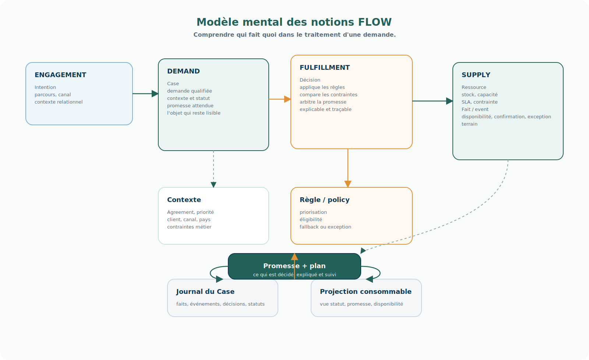
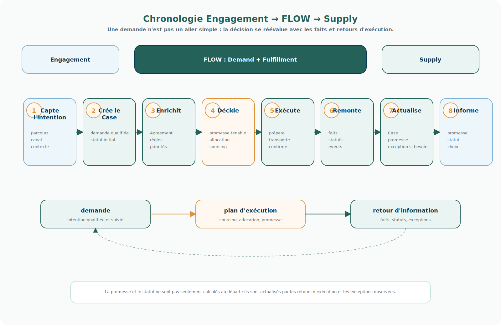

# Modèle de fonctionnement de FLOW

<!-- FLOW-READING-CARD:START -->

  
Repère de lecture

  

    

      Public cible
      <strong>Sponsor, Direction, Architecte</strong>
    

    

      Temps de lecture
      <strong>3 min</strong>
    

    

      Usage
      <strong>Comprendre la vision, les arbitrages et le vocabulaire cible</strong>
    

  

<!-- FLOW-READING-CARD:END -->

Cette page complète le positionnement de FLOW au niveau Vision.

Le positionnement explique le périmètre : FLOW porte Demand + Fulfillment, tandis qu'Engagement et Supply restent adhérents.

Le modèle de fonctionnement explique comment cela marche en termes de notions métier : quels objets sont manipulés, quelles décisions sont prises, et comment l'information remonte après l'exécution.

Le niveau Architecture cible détaille ensuite les flux qui traversent les produits et fonctionnalités dans la page [Flux fonctionnels FLOW](../architecture-cible/flux-fonctionnels-flow.md).

## Modèle mental des notions

Le modèle Demand ne doit pas être lu comme une simple gestion de commandes.

Il combine plusieurs notions qui ont chacune un rôle précis.

| Notion | Rôle dans FLOW | Portée principale |
| --- | --- | --- |
| Intention | Besoin exprimé dans un parcours, un canal ou une interaction. | Engagement |
| Case | Objet durable qui porte la demande, son contexte, ses statuts et son historique. | Demand |
| Contexte | Informations nécessaires pour comprendre la demande : client, canal, pays, Agreement, priorité. | Demand |
| Fait | Élément observé ou calculé à un instant donné : stock disponible, confirmation, retard, statut. | FLOW ou Supply |
| Event / événement | Signal publié lorsqu'un fait ou un état significatif change. | Tous domaines |
| Règle / policy | Critère explicite qui guide la décision : éligibilité, priorité, fallback, exception. | Fulfillment |
| Décision | Choix traçable qui fait progresser le Case : promettre, réserver, splitter, reporter, refuser. | Fulfillment |
| Promesse | Obligation ou garantie à tenir : quantité, délai, lieu, service ou disponibilité. | Demand + Fulfillment |
| Plan d'exécution | Trajectoire décidée pour servir la demande. | Fulfillment vers Supply |
| Ressource | Stock, capacité, service, site, partenaire ou contrainte mobilisable. | Supply |
| Statut | État partagé permettant de suivre le Case, la promesse ou l'exécution. | Tous domaines |
| Exception | Situation où la promesse ou le plan ne tient plus et doit être réarbitré. | Fulfillment |

Le point clé est que FLOW rend ces notions explicites.

Une demande devient pilotable parce que les faits, événements, règles, décisions et promesses sont rattachés au Case.

## Chronologie de bout en bout

La lecture chronologique aide à comprendre que FLOW ne fonctionne pas comme un simple passage de relais.

Une demande progresse par décisions successives et par retours d'information.

1. Engagement capte une intention dans un parcours, un canal, une interface ou une négociation.
2. FLOW crée ou actualise un Case pour porter la demande dans la durée.
3. Demand enrichit la demande avec le contexte, l'Agreement, les priorités et les règles applicables.
4. Fulfillment arbitre une promesse tenable et une trajectoire d'exécution.
5. Supply exécute physiquement ou opérationnellement selon le plan décidé.
6. Supply remonte des faits, statuts et événements : confirmation, retard, exception, indisponibilité, preuve.
7. FLOW actualise le Case, la promesse et les décisions si nécessaire.
8. Engagement peut informer le client, le fournisseur, le collaborateur ou le partenaire avec un statut cohérent.

## Ce qui remonte vers FLOW

Les retours d'information sont aussi importants que la demande initiale.

FLOW a besoin de recevoir :

- des faits de disponibilité ;
- des événements d'exécution ;
- des confirmations ou refus ;
- des statuts transport, entrepôt, magasin, fournisseur ou partenaire ;
- des exceptions ;
- des documents ou preuves opérationnelles ;
- des changements de contrainte.

Ces retours permettent au Case de rester vivant.

Sans eux, FLOW pourrait promettre, mais ne pourrait pas expliquer, corriger ou réarbitrer.

## À retenir

FLOW ne remplace pas Engagement et Supply.

FLOW rend leur collaboration gouvernable.

Engagement exprime et reçoit.

Supply expose et exécute.

FLOW porte le Case, la promesse, la décision et la traçabilité qui permettent de relier les deux.
