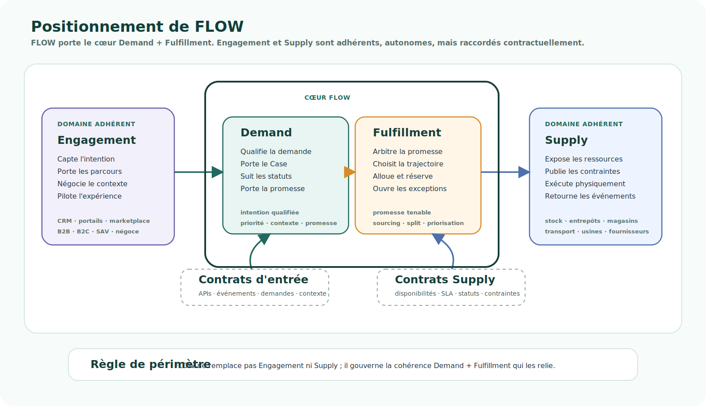

# Vision

<!-- FLOW-READING-CARD:START -->
<div class="flow-reading-card">
  <div class="flow-reading-card__title">Repère de lecture</div>
  <div class="flow-reading-card__grid">
    <div>
      <span>Public cible</span>
      <strong>Sponsor, Direction, Architecte</strong>
    </div>
    <div>
      <span>Temps de lecture</span>
      <strong>9 min</strong>
    </div>
    <div>
      <span>Usage</span>
      <strong>Comprendre la vision, les arbitrages et le vocabulaire cible</strong>
    </div>
  </div>
</div>
<!-- FLOW-READING-CARD:END -->

## Ambition : converger sans nécessairement uniformiser

Le Groupe Beaumanoir doit réussir une <span class="flow-keyword">convergence</span> complexe.

Il doit créer du commun entre des marques, canaux, business models et héritages IT très différents, sans perdre les singularités qui font leur valeur.

La réponse ne peut pas être une uniformisation brutale.

Elle ne peut pas non plus être une centralisation ERP classique qui chercherait à faire rentrer toute la diversité du groupe dans un modèle unique.

L'ambition de FLOW est de construire un socle commun là où la cohérence est critique — <span class="flow-keyword">demandes</span>, <span class="flow-keyword">stock</span>, <span class="flow-keyword">promesses</span>, <span class="flow-keyword">décisions métier</span>, allocation, exécution, événements et exceptions — tout en laissant les marques, canaux et domaines spécialisés conserver leur autonomie là où elle crée de la valeur.

<div class="flow-conviction">
  <p>La convergence n'est pas l'uniformisation.</p>
  <p>Elle consiste à choisir le bon niveau de commun, au bon endroit, pour la bonne responsabilité.</p>
</div>

## Vision synthétique : FLOW comme moteur de convergence opérationnelle

<div class="flow-conviction">
  <p>FLOW est le moteur de convergence opérationnelle du groupe.</p>
  <p>Il fédère les demandes, gouverne les décisions métier, mobilise le stock et le réseau d'exécution, tout en préservant les singularités business utiles.</p>
</div>

Cette vision repose sur quelques convictions fortes :

- La <span class="flow-keyword">convergence</span> n'est pas l'uniformisation : elle doit construire le bon niveau de commun pour chaque responsabilité.
- Le <span class="flow-keyword">centre de gravité</span> du SI doit se déplacer de l'ERP-document vers la demande, la décision métier et la satisfaction client / utilisateur.
- Gérer des commandes n'est plus suffisant : il faut savoir traiter des <span class="flow-keyword">demandes</span>.
- Le cœur de FLOW est <span class="flow-keyword">Demand + Fulfillment</span> : qualifier la demande, porter la promesse à tenir et arbitrer la trajectoire d'exécution.
- Les silos B2B, B2C, marques, groupes ou canaux peuvent exister chez les consommateurs de la plateforme, mais pas dans la <span class="flow-keyword">plateforme</span> elle-même.
- La variation métier doit être pilotée par le contexte, les <span class="flow-keyword">Agreements</span> et les règles, sans rendre le SI ingouvernable.
- La <span class="flow-keyword">gouvernance MDM</span> doit distinguer sources de référence, projections et contrats d'échange, pour éviter l'inventaire de données supposées maîtres et les flux opportunistes.

## Concepts qui structurent FLOW

| Concept | Message |
| --- | --- |
| <span class="flow-keyword">Engagement</span> | Les parcours, canaux, interfaces et négociations captent l'intention, mais ne constituent pas le cœur de FLOW. |
| <span class="flow-keyword">Demande</span> | Le point de départ n'est plus la commande, mais l'intention à instruire, décider, promettre, satisfaire et expliquer. |
| <span class="flow-keyword">Demand + Fulfillment</span> | Le cœur de FLOW qualifie la demande, porte la promesse à tenir et arbitre comment la servir. |
| <span class="flow-keyword">Plateforme Demand</span> | FLOW gouverne des ressources communes et ouvre des capacités contrôlées aux domaines consommateurs et contributeurs. |
| <span class="flow-keyword">Stock Unifié</span> | Le stock devient une capacité d'entreprise, mobilisable pour promettre, réserver, allouer et optimiser. |
| <span class="flow-keyword">Agreement</span> | Les variations métier sont pilotées par le contexte, les Agreements et les règles plutôt que par la prolifération des processus. |
| <span class="flow-keyword">Source de référence / Projection</span> | Dans un SI distribué, une information fait référence lorsqu'elle est contrôlée par un processus responsable ; elle n'est pas maître de manière absolue. |
| <span class="flow-keyword">Contrat de données</span> | L'information en transit doit être publiée, consommée, supervisée et gouvernée comme un actif durable, pas comme un flux projet opportuniste. |
| <span class="flow-keyword">Gouvernance MDM</span> | Faire du MDM ne consiste pas seulement à lister des objets maîtres : il faut qualifier les sources de référence, les projections, les contrats d'échange et les responsabilités de gouvernance. |

→ Voir aussi : [Concepts clés du programme FLOW](concepts-cles.md).

## Pourquoi FLOW existe

Le groupe s'est construit par croissance, acquisitions et rapprochements successifs.

Cette histoire a créé une grande richesse business, mais aussi un SI très hétérogène : cultures digitales, applications autonomes, socles historiques vieillissants, ERP centralisé, plateformes spécialisées.

Les irritants sont connus : coûts IT, synchronisations fragiles, difficulté à retrouver une vérité fiable, vision insuffisamment centralisée du stock et des demandes, optimisation du fulfillment limitée à l'échelle du groupe.

Le problème n'est donc pas l'absence de commun.

Le problème est de construire ce commun sans écraser les singularités utiles.

## Le choix de modèle

Une forme de centralisation est nécessaire.

Mais une centralisation totale rigidifierait le groupe.

FLOW propose donc un modèle fédéré : centraliser lorsque la cohérence est critique, unifier lorsque le modèle doit être partagé, standardiser lorsque la variation n'apporte pas de valeur, fédérer lorsque plusieurs modèles doivent coexister, différencier lorsque le business l'exige.

## Les ruptures clés

FLOW change le point de départ de la conception.

La question centrale n'est plus :

> Comment gérer une commande ?

La question devient :

> Quelle demande faut-il comprendre, décider, promettre, satisfaire et expliquer ?

FLOW déplace donc le centre de gravité du SI :

```text
ERP / documents / comptabilité
OMS / commande / canal
        ↓
Demande / décision métier
Satisfaction client-utilisateur
Stock et réseau d'exécution
```

<div class="flow-conviction">
  <p>FLOW ne cherche pas à mieux gérer les commandes.</p>
  <p>FLOW cherche à mieux satisfaire les demandes.</p>
</div>

FLOW introduit aussi une rupture sur l'information.

Dans une approche classique, la master data est souvent traitée comme l'inventaire des objets supposés maîtres : clients, fournisseurs, articles, sites, magasins, entrepôts, organisations, stocks ou conditions.

Dans FLOW, la première question est différente : quelle information fait référence, pour quel usage, par quel processus, et sous quelle responsabilité ?

Pour l'<span class="flow-keyword">information au repos</span>, l'enjeu est de distinguer les sources de référence, les projections et les vues qui rendent l'information consommable sans devenir automatiquement maîtres.

Pour l'<span class="flow-keyword">information en transit</span>, l'enjeu est d'éviter que chaque besoin produise un flux projet opportuniste, ou pire une lecture directe de base de données.

Une base de données n'est pas une ressource publique d'échange : une application doit exposer une interface stable, gouvernée et compatible dans la durée.

Les échanges critiques doivent donc devenir des <span class="flow-keyword">contrats de données</span> publiés, consommés, supervisés et gouvernés.

<div class="flow-conviction">
  <p>FLOW configure des capacités d'action.</p>
  <p>Il ne reconstruit pas un grand miroir administratif de l'entreprise.</p>
</div>

<div class="flow-conviction">
  <p>FLOW ne doit pas seulement remplacer des applications.</p>
  <p>Il doit remplacer la logique de tuyauterie projet par une logique de contrats de données gouvernés.</p>
</div>

## Ce que porte la plateforme

FLOW est une <span class="flow-keyword">plateforme</span> de fédération des demandes de l'entreprise.

Elle porte le cœur commun <span class="flow-keyword">Demand + Fulfillment</span> : qualifier les demandes, gouverner les décisions métier, porter la promesse à tenir et arbitrer les trajectoires d'exécution.



→ Voir aussi : [Positionnement de FLOW](positionnement-flow.md).

→ Pour comprendre le déroulé opérationnel, voir aussi : [Modèle de fonctionnement de FLOW](modele-fonctionnement-flow.md).

FLOW réécrit donc la <span class="flow-keyword">colonne vertébrale opérationnelle</span> du SI : demandes, décisions métier, stock, promesses, événements, statuts et orchestration transverse.

Il ne réécrit pas tout le SI.

Les composants structurants sont :

- Plateforme de Case Management.
- Stock Unifié.
- Fulfillment Network / Réseau d'Exécution.
- Système de décision métier : règles, policies, contraintes et optimisation.
- Vues 360.
- Intégrations avec les services existants lorsque leur valeur métier justifie leur maintien.

La gouvernance des données en transit reste une pratique transverse : elle évite que les échanges entre ces composants redeviennent des flux projet opportunistes.

FLOW n'a pas vocation à absorber tout le SI.

Il doit empêcher que les autonomies locales redeviennent des silos au cœur du traitement de la demande.

<span class="flow-keyword">Engagement</span> et <span class="flow-keyword">Supply</span> sont des domaines adhérents à FLOW.

Engagement capte l'intention et porte les parcours : front-office, CRM, portails, marketplaces, négoce, service client ou outils partenaires.

Supply expose les ressources, capacités, contraintes et événements d'exécution : stock, entrepôts, magasins, transport, usines, fournisseurs ou partenaires logistiques.

Ces domaines conservent leur autonomie, mais ils doivent être raccordés à FLOW par des APIs, événements, contrats de données, statuts, projections ou règles d'interaction.

Les services existants qui portent une valeur métier spécifique — CBS, SAV Client Sarenza, outils fournisseurs, systèmes logistiques spécialisés — peuvent donc être réintégrés autour de FLOW comme consommateurs, contributeurs, sources d'événements ou domaines spécialisés.

<div class="flow-conviction">
  <p>FLOW ne demande pas de tout réécrire.</p>
  <p>Il demande de rebrancher les services utiles sur une colonne vertébrale commune.</p>
</div>

## Points à arbitrer

La vision ne peut pas rester théorique.

Elle doit traiter plusieurs points durs :

- Sortie progressive de SAP ECC : migration difficile à phaser du fait de la nature monolithique de la solution.
- C-LOG : une partie de la décision de fulfillment est déjà distribuée côté exécution.
- Stock temps réel : dépendance aux événements POS et logistiques pour garantir une fraîcheur suffisante.
- Capacités d'intégration des systèmes réintégrés : APIs, événements, statuts, documents et réconciliation nécessaires pour brancher les services existants sur FLOW.
- PLM, catalogue, Article / EAN : FLOW ne peut pas dépendre d'un PLM unique ; il doit clarifier le catalogue nécessaire pour vendre, acheter, promettre et exécuter.
- Fournisseur, usine et Agreement : FLOW doit sortir du paramétrage fournisseur monolithique, cartographier les sources de référence, sécuriser le calcul des dates de promesse et clarifier si CBS devient la SRM cible.
- Gouvernance MDM de l'information : sources de référence, projections, contrats d'échange, rôles data et sortie progressive des flux opportunistes ou base-à-base.
- Promesse commerciale Wholesale : priorisation commerciale des meilleurs clients, potentiellement en tension avec une logique de promesse ferme ou de premier arrivé, premier servi.
- Module Négoce StoreLand : responsabilités mélangées entre design commercial, engagement, commandes d'achat et Demand & Fulfillment.

Ces hotspots montrent que FLOW n'est pas seulement un outil cible.

FLOW est aussi un cadre d'arbitrage pour traiter les tensions réelles de convergence du groupe.

## Valeur attendue

La valeur de FLOW vient du lien entre les problèmes observés et les capacités que la plateforme rend possibles.

| Problème observé | Ce que FLOW apporte | Valeur attendue |
| --- | --- | --- |
| Stock dispersé | Stock Unifié, APIs de disponibilité, réservation, allocation | Vision plus fiable du stock et optimisation du fulfillment omnicanal |
| Demandes dispersées | Plateforme de fédération des demandes, Case Management, événements communs | Décloisonnement et continuité de traitement |
| Informations difficiles à réconcilier | Sources de référence qualifiées, projections gouvernées, événements, Vues 360 | Meilleure capacité à retrouver une vérité exploitable |
| Flux projet foisonnants ou base-à-base | Contrats de données, séparation publication / consommation, supervision des échanges | Moins de tuyauterie opportuniste et une meilleure gouvernance des données en transit |
| Variations métier spécifiques | Agreements, règles, policies, moteur de décision métier | Singularités préservées sans prolifération des processus |
| Décisions de fulfillment distribuées | Contrats entre demande et exécution | Moins d'erreurs d'aiguillage et meilleure optimisation globale |
| Finance et auditabilité | Faits, événements, documents et statuts exploitables | Meilleure intégration avec Finance et capacité à reconstruire l'histoire d'une demande |

## À retenir : ne pas se tromper de promesse

| Ne pas imaginer que... | FLOW vise plutôt à... |
| --- | --- |
| FLOW est seulement un projet de remplacement applicatif. | Faire converger des responsabilités critiques aujourd'hui dispersées. |
| FLOW cherche à mieux gérer les commandes. | Mieux traiter les demandes, y compris commandes, retours, SAV, exceptions et promesses à tenir. |
| FLOW est une plateforme d'engagement. | FLOW laisse Engagement porter les parcours et concentre son cœur sur Demand + Fulfillment. |
| FLOW impose un modèle unique à toutes les marques. | Construire une plateforme commune qui préserve les singularités business utiles. |
| FLOW est un nouvel ERP ou un nouvel OMS. | Déplacer le centre de gravité vers la demande, la décision métier, le stock et le réseau d'exécution. |
| FLOW doit absorber tout le SI. | Réécrire la colonne vertébrale opérationnelle du SI, pas tous ses organes spécialisés. |
| FLOW oblige à réécrire tous les services existants. | Réintégrer les services utiles autour d'une cohérence commune lorsque leur valeur métier justifie leur maintien. |
| FLOW reconstruit une master data globale ou un inventaire d'objets supposés maîtres. | Qualifier les sources de référence, les projections et les capacités d'action nécessaires pour traiter les demandes de manière fiable, explicable et optimisable. |
| FLOW se contente de refaire des flux entre applications. | Gouverner les informations en transit comme des contrats durables entre sources, consommateurs et responsabilités métier, sans exposer les bases de données comme ressources publiques. |

## Aller plus loin

La vision détaillée est découpée en chapitres pour faciliter la lecture :

1. [Ambition](vision-detaillee/1-ambition.md).
2. [Ruptures](vision-detaillee/2-ruptures-structurantes.md).
3. [Solution](vision-detaillee/3-plateforme-flow.md).
4. [Hotspots](vision-detaillee/4-hotspots.md).
5. [Valeur attendue](vision-detaillee/5-valeur-attendue.md).

## Pages associées

- [Concepts clés du programme FLOW](concepts-cles.md).
- [Principes directeurs](../principes-directeurs/index.md).
- [Architecture cible](../architecture-cible/index.md).
- [Transformation](../transformation/index.md).
